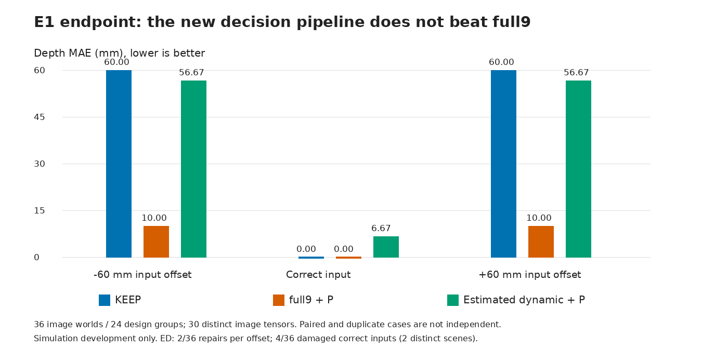
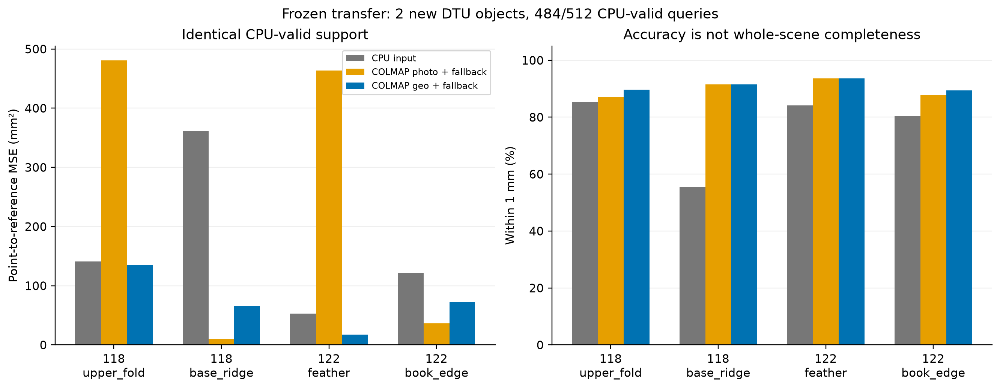
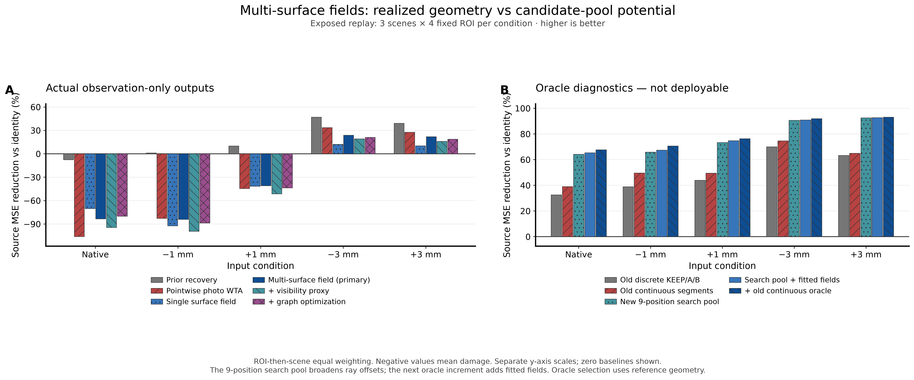

# Map Denoise Research

**多视图证据驱动的多假设几何修订。** 更新于 **2026-10-08**。

本仓库保存算法源码、冻结协议、正负结果、测试及修订记录。目前的几何主线是：利用照片与相机标定构造几种可能的表面解释，再决定保留原点还是接受修正。最近已实现收益选择、连续射线位置搜索，以及局部一／双表面逆深度混合回归。

自研方法已支持**有条件的偏移恢复**，尚不是默认开启的通用滤波器；部署默认仍为 `identity`。10月8日最新混合像素机制实验中，动态前后景模型保留了正确候选的评分信息，但尺度准入与原区间决策丢掉收益，端到端仍弱于 full9。此前真实旧场景的新证据配简单选择使MSE降低30.19%，仍新增两处好点损伤；10月1日官方COLMAP新物体迁移降低56.92%是成熟方法成绩。Windows / RTX5080交接包仍对应9月22日CPU版本；最新合成CPU试验不是5080或真实迁移验证。

## 从这里开始

| 你想做什么 | 入口 |
|---|---|
| 看最新混合像素：评分有用，为何行动失败 | [报告](research_snapshots/2026-10-08/mixed-pixel-20261008T041249Z/REPORT.md) · [原始结果](research_snapshots/2026-10-08/mixed-pixel-20261008T041249Z/evaluation/RESULTS.csv) · [三轮归档与便携核验](publication/MIXED_PIXEL_20261008.md) |
| 看最新贡献消融：收益究竟来自哪里 | [完整报告](research_snapshots/2026-10-07/selector-attribution-20261007T180539Z/REPORT.md) · [逐项贡献](research_snapshots/2026-10-07/selector-attribution-20261007T180539Z/evaluation/ATTRIBUTION.csv) · [发布与复算](publication/SELECTOR_ATTRIBUTION_20261008.md) |
| 看轨迹证据与条件数学构造 | [前轮报告](research_snapshots/2026-10-07/track-discrimination-20261007T160716Z/REPORT.md) · [理论](research_snapshots/2026-10-07/track-discrimination-20261007T160716Z/theory/THEORY.md) |
| 看此前邻域区间支持回放 | [10月7日早期报告](research_snapshots/2026-10-07/plane-support-20261007T084206Z/REPORT.md) · [数学关系](research_snapshots/2026-10-07/plane-support-20261007T084206Z/theory/THEORY.md) · [发布与复算](publication/PLANE_SUPPORT_20261007.md) |
| 阅读完整研究记忆书与对话、避免重复实验 | [GitBook完整入口](docs/research-book/README.md) · [目录](docs/research-book/SUMMARY.md) · [最新状态](docs/research-book/increment/docs/LATEST_STATE.md) |
| 看最新冻结迁移及损伤账 | [10月1日实验报告](research_snapshots/2026-10-01/colmap-transfer-20260930T180000Z/REPORT.md) · [原始指标](research_snapshots/2026-10-01/colmap-transfer-20260930T180000Z/evaluation/RESULTS.json) · [发布说明](publication/TRANSFER_20261001.md) |
| 在 Windows 上交给 Codex 开发 | [启动提示词](handoffs/v28-windows-5080/START_WINDOWS.md) · [完整交接 ZIP](https://github.com/jupiternaut/map-denoise-research/raw/8666e3ffee09a3a1a105fa523ed94ae2218fde01/handoffs/v28-windows-5080.zip) |
| 看工具架构与验收范围 | [架构](handoffs/v28-windows-5080/ARCHITECTURE.md) · [实施任务](handoffs/v28-windows-5080/TASK.md) · [验收标准](handoffs/v28-windows-5080/ACCEPTANCE.md) |
| 看最近七轮实验及发布范围 | [9 月 26 日实验导航与 9 月 28 日发布说明](publication/REPLAY_20260928.md) |
| 看最新多表面构造 | [报告](research_snapshots/2026-09-26/multisurface-field-lab-20260926T102842Z/REPORT.md) · [数学模型](research_snapshots/2026-09-26/multisurface-field-lab-20260926T102842Z/MODEL.md) · [机制分类与数学定位](publication/METHOD_POSITIONING_20260928.md) |
| 复查最新原始指标 | [METRICS.csv](research_snapshots/2026-09-26/multisurface-field-lab-20260926T102842Z/run_evidence/evaluation/METRICS.csv) · [汇总](research_snapshots/2026-09-26/multisurface-field-lab-20260926T102842Z/run_evidence/evaluation/SUMMARY.json) |
| 看先前冻结方法的确认实验 | [9 月 22 日完整报告](research_snapshots/2026-09-22/closeout-confirmation-20260922T133739Z/EXPERIMENT_REPORT.md) · [协议](research_snapshots/2026-09-22/closeout-confirmation-20260922T133739Z/EXPERIMENT_PROTOCOL.md) · [执行口径](research_snapshots/2026-09-22/closeout-confirmation-20260922T133739Z/EXECUTION_NOTE.md) |
| 阅读当前 CPU 实现 | [包说明](handoffs/v28-windows-5080/reference/package/README.md) · [运行时](handoffs/v28-windows-5080/reference/package/v28_closeout/runtime.py) · [表面假设评分](handoffs/v28-windows-5080/reference/package/v28_closeout/surfacelet.py) |
| 阅读元研究与历史探索 | [元研究导航](meta_research/README.md) · [V23–V25 / CPR / 精确搜索](PROGRESS_20260916.md) · [V19–V22](PROGRESS_V22.md) |

## 最新进展：混合像素有定位信息，但当前决策没有兑现

用两侧表面共同解释像素 `I = αF + (1−α)B`；α是像素足迹的面积覆盖率，不是透明度。固定外观容量、相机、候选及评分像素，比较动态/固定归属，再与原full9系统对照。E0与E1已完成，E2确认及真实回放未启动。

| 输入状态 | 不处理MAE（mm） | full9 + P | 动态混合ED + P |
|---|---:|---:|---:|
| −60 mm | 60 | **10** | 56.67 |
| 正确输入 | 0 | **0** | 6.67 |
| +60 mm | 60 | **10** | 56.67 |

36个图像世界、三个初态、六臂共648条决策；仅30个不同图像张量，不能将重复宽度或双折当成独立样本。ED每个偏移方向改善2/36，正确输入恶化4/36。原始动态评分在全部30个有信息世界将正确候选排第一，6个同色负控保持平坦，但端到端门槛未通过。

具体瓶颈不是再次缺少候选：24个边界世界的局部尺度不可估，规则直接KEEP；另有原始损失在600mm最低，却因接受区间不对称，均匀区间均值选择660mm并损伤正确点。下一步应拆开尺度准入与行动规则，直接最小残差必须作为强对照。**只追平full9算接口修复，不算新增方法优势。**



[三轮来源、合成数组与核验入口](publication/MIXED_PIXEL_20261008.md)。历史字节及更正保留；此次更新GitHub，既有GitBook网页未重建。

## 10月8日早期进展：新证据配简单选择已获得主要修复收益

目标仍是保留有效几何、修复错误。固定两个已暴露场景、四ROI、512请求（484原CPU有效），在21个既定余项的105个已有候选中比较16个策略臂。先封存预测再评价，不增加坐标、不修匹配、不调阈值。

| 方法 | ROI等权MSE（mm²） | 相对旧照片法改善 | 改善/恶化/不变（484点） |
|---|---:|---:|---:|
| 旧照片选择 | 23.9553 | — | 0/0/484 |
| 旧法仅取消歧义拒绝 | 49.1193 | −105.05% | 3/1/480 |
| 新star证据＋普通均值选择 | **16.7222** | **30.19%** | **4/2/478** |
| 新star证据＋最强轨迹选择 | 17.0041 | 29.02% | 3/3/478 |
| 新star证据＋最坏收益选择 | 16.8569 | 29.63% | 3/2/479 |

以均值选择为对照，加入“所有允许深度均改善”门槛少改善0.56个百分点，再改最坏收益排序增量为0；以最强轨迹为对照则多改善0.61个百分点。这是条件对照，不是模块的普适因果贡献比例。两次大修复在star系列的简单/复杂规则中选择相同；更简单的阈值交集star_full配均值也达到30.18%。

仍有两处≤1→>1mm的新伤害，不能把总体MSE下降解释为“保留正确几何”已完成。额外源间约束cycle会撤回两次大修复，最坏收益成绩只剩3.87%；更复杂不自动更好。只取消旧拒绝规则还会把一个44.11mm错点放大到122.98mm。当前应保留新证据与简单对照，优先解决错误表面支持，而非继续堆排序器。

28项单测、84个历史ID复现及独立重算336选择/8704逐点行通过；从原始激光重算614坐标行最大差0。语义审计为同家族暂定WARN，限定为两旧场景开发回放、最近激光顶点指标，未改部署默认。公开子集含代码、证据、协议、正负结果、更正与审计；不含私有审稿轨迹、原始数据集和数组缓存。

[完整报告](research_snapshots/2026-10-07/selector-attribution-20261007T180539Z/REPORT.md) · [原始结果](research_snapshots/2026-10-07/selector-attribution-20261007T180539Z/evaluation/RESULTS.json) · [复算入口](publication/SELECTOR_ATTRIBUTION_20261008.md)。这次更新GitHub快照与README，既有GitBook网页未重建。

## 10月7日早期进展：邻域区间支持带来小幅增益，但仍会误改好点

目标仍是保留有效几何、修复不足。固定两个旧场景、四个ROI、512请求中的484原有效点；仅在21个既定余项的105个原候选中选择，不增加坐标。把邻居平面、法向和射线误差传播为深度区间，再比较确定/可能支持；与同一邻居掩码下的点值投票对照。

| 方法 | ROI等权MSE（mm²，越低越好） | >5mm错点 | 新增≤1→>1mm损伤 |
|---|---:|---:|---:|
| 旧照片选择器 | 23.9553 | 12 | 0 |
| 照片＋邻域点值投票 | 64.0485 | 9 | 1 |
| **照片＋邻域区间投票** | **23.4164** | **10** | **1** |
| 官方封存对照 | 22.4003 | 12 | 0 |

主方法相对旧照片法MSE降低**2.2493%**：两点新增改善（13.8588→2.3624mm、8.4536→0.1823mm）、一点恶化（0.5080→2.0799mm）、其余481点不变；另补出一个原缺失点，不混入主均值。**“降低MSE且不新增好点损伤”的主验收未通过。** 区间规则避免一次点值投票造成的143.8445mm大错，也放弃了两个本可成功的修复，不能只报告避错。

本轮的数学产物是有明确误差、候选覆盖和污染条件的射线深度界，以及可计算的支持排序规则；真实误差预算仍为工程假设，非校准置信保证。最重要的缺口是：**支持排序稳定，不等于支持属于目标表面。** 单视图光度门未拒绝任何邻域推荐，不能声称它已解决归属。

19项测试通过；独立审查对1123个既有坐标重新计算激光距离，最大差0。审查为同家族暂定WARN，主要限定是旧场景非盲、预算假定与执行先后证据边界。主指标是固定点到激光最近顶点距离，不是完整官方DTU榜单或薄层拓扑保证。

[全部结果与反例](research_snapshots/2026-10-07/README.md) · [原始表格](research_snapshots/2026-10-07/plane-support-20261007T084206Z/evaluation/POINT_METRICS.csv) · [独立审查](research_snapshots/2026-10-07/plane-support-20261007T084206Z/EXPERIMENT_AUDIT.md)。本次同步GitHub实验快照与README；既有GitBook封存/离线网页未重建，不把它称为已包含10月7日全部增量。

## 10月1日历史进展：成熟MVS的收益迁移到两个新物体

冻结“COLMAP 4.2.1几何一致性＋无效处旧点回退”，直接用于未参与前轮开发的DTU scan118/122。每场景两个照片定义ROI，512个请求像素先固定，484个CPU有效点构成所有主臂的共同总体；预测封存后才获取官方三维参照。下表是四ROI等权点到参照最近距离，**输入为同五张照片产生的CPU初值，不是旧成品网格**。

| 方法 | MSE（mm²） | 相对CPU MSE | ≤1mm点数/484 | >5mm点数/484 |
|---|---:|---:|---:|---:|
| CPU初始重建 | 168.98746 | — | 370 | 90 |
| 官方COLMAP纯光度＋回退 | 247.71447 | 恶化46.59% | 436 | 19 |
| 官方COLMAP几何一致性＋回退 | **72.80297** | **改善56.92%** | **441** | 26 |

scan118/122分别改善59.93%/48.24%，四个ROI均改善。262点变好、185点变差、37点回退不动；原本370个≤1mm点中有6个越过1mm，90个>5mm错点中64个被修到≤5mm。新增覆盖另计，不拿删除/缺失坏点改善主指标。

独立复算还定位到：剩余26个>5mm错点全部来自37个CPU回退点（贡献残余MSE的99.80%）。另一方面，COLMAP可以传播到传入深度区间外，而CPU搜索有硬边界；主总体50个区间外输出贡献约78%的MSE收益。因此这是**整套方法**的迁移收益，不能全部归于相同搜索域下的几何一致性。



本轮把**相机接口正确、强基线有效、冻结规则在新物体上有收益**三件事接起来；仍未证明自研选择器超过这个成熟基线、跨传感器普适性或完整薄层安全。它是两物体的同来源迁移试验，不是官方完整DTU排行榜。纯光度MAE降低而MSE升高，说明还必须面对少量严重错误，不能只追平均照片匹配或正确点数。

完整书稿现包含封存原书、所有登记增量、可见消息、来源快照与更正链；[公开范围和哈希](docs/research-book/PUBLICATION_MANIFEST.json)明确排除隐藏推理、原始系统/工具载荷和环境。这不是原始数据集全盘备份。下载目录可直接打开`READ.html`；GitHub本身不会自动托管HTML为网站。

## 9月26日历史进展：从候选位置到共享多表面

9 月 26 日的七轮实验使用 scan55/65/69 × 每场景四个 ROI × 五种输入状态，共 **60 案例**。这些场景已经看过，属于**旧场景开发回放，不是新的独立确认**。后续拟合使用的照片也不再算作该方法的留出验证视图。

下面是相对不处理的 **MSE 降幅**；正数改善，负数恶化。它不是“正确点比例”，也不是课题完成进度。

| 可执行方法 | 原始输入 | −1 mm | +1 mm | −3 mm | +3 mm |
|---|---:|---:|---:|---:|---:|
| 旧恢复器，开发锁定的偏重恢复工作点 | −7.67% | 1.16% | 10.04% | 46.99% | 39.02% |
| 同路由、照片网格步长 | −6.40% | 3.18% | 9.81% | 47.21% | 38.55% |
| 新双表面场，本轮主方法 | −83.35% | −84.10% | −41.00% | 23.89% | 21.95% |

**已获得的具体内容：**

- 旧恢复器在 ±3 mm 回放条件均改善 12/12 个 ROI，但原始输入仍全部退化；没有把恢复收益当成原始数据上的净收益。
- 连续线段 Oracle 有解析计算与检索核验；实际照片选步长仅有小幅条件收益，没有全面升级。
- 新增共享曲面模块：局部六参数逆深度场、EM 候选—表面归属、可见性及局部图选择。双面相对单面在 −3/+3 mm 有 11/12、12/12 个 ROI 更好，但整个系统仍弱于旧恢复器。
- 保留了表示／拟合与选择的分项诊断，以及可以独立检查的表格、源码、机制测试和科研图。

### Oracle 是诊断，不是可部署成绩

| 候选域：用激光参考逐点选最好位置 | −3 mm | +3 mm |
|---|---:|---:|
| 原 KEEP/A/B 三个位置 | 69.94% | 63.27% |
| 原位置之间的连续线段 | 74.69% | 64.99% |
| 扩大为九个射线位置，不含新曲面 | 90.66% | 92.57% |
| 九位置 + 新拟合曲面 | 90.95% | 92.75% |
| 新池与原连续位置的并集 | 91.94% | 93.10% |

**主要上限增量来自更宽的位置搜索。** 在九位置池之外，新曲面只再增加约 0.28/0.18 个百分点，不能把 91.94%/93.10% 全归功于“场空间”。仅 KEEP/K2 两张场候选的 [Oracle 事后诊断](research_snapshots/2026-09-26/multisurface-field-lab-20260926T102842Z/run_evidence/posthoc_field_capacity/SUMMARY.json)为 62.69%/62.66%，说明曲面拟合未保留宽池里的全部有用坐标，当前选择也未兑现自身候选潜力。候选不一定满足实际方法的有效视图／KEEP 条件；这些数不是物理极限，也不证明可直接实现。



### 原始输入到底差多少？

同一固定支持下，原始输入到激光参考最近点的区域等权 **MAE 为 0.562 mm，MSE 为 0.753 mm²，汇总 MSE 开方为 0.868 mm，1 mm 内比例为 90.18%**。这不是整数据集逐点混合统计，也不是激光参考无误差的证明。单向最近邻误差不单独保证覆盖、薄层身份或拓扑。

下一步优先检验**观测是否足以识别已有好候选**：保留逐视图证据，比较位置与曲面法线联合解释，以及未参与候选拟合的视图。这里是研究方向，不是已经完成的新实验。[发布范围与复现限制](publication/REPLAY_20260928.md)

## 先前确认：9 月 22 日冻结方法的跨场景条件恢复

固定主方法为 `post_A_keep`，模型使用旧开发场景 scan24/37 的归档样本训练。scan40 只作工程适配；scan55/65/69 为三个同来源确认场景，每场景四个 ROI。所有构造输出封存后才获取并打开独立几何参考，未依据确认结果改模型或阈值。

指标为**固定原始源点行到参考几何的最近邻 MSE，单位 mm²**，先对场景内 ROI 等权平均，再对三个场景等权平均。扰动沿逐点参考相机射线施加；这些不是整场景刚体位移。

| 输入 | 不处理 identity | 主方法 post_A_keep | 相对不处理 | 改善的 ROI |
|---|---:|---:|---|---:|
| 原始输入 | 0.753165 | 0.814326 | 恶化 8.12% | 0/12 |
| −1 mm 扰动 | 0.803265 | 0.819364 | 恶化 2.00% | 4/12 |
| +1 mm 扰动 | 1.286755 | 1.161440 | 改善 9.74% | 11/12 |
| −3 mm 扰动 | 2.867611 | 1.833010 | 改善 36.08% | 12/12 |
| +3 mm 扰动 | 4.295019 | 2.843762 | 改善 33.79% | 12/12 |

**已测到的能力：** 冻结方法在三个新场景的 ±3 mm 条件下均有收益；相对接受相同点数的随机筛选，主方法在这两种条件下的 MSE 还低约 19%。这支持修正候选及收益筛选的条件性价值。

**仍然存在的失败：** 原始输入的三个场景、12 个 ROI 全部退化，故默认仍为 `identity`。原始、正负小扰动的响应值得进一步分析灵敏度与不对称性，但本轮没有识别其因果机制。

解读边界：

- 百分比是 **MSE** 的相对变化，不是 MAE/RMSE 降幅；12 个 ROI 不是 12 个独立场景。
- 这是同 DTU/GeoSVR 来源的新场景确认，不是跨传感器普适性证明，也不是 DTU 官方整场景排行榜。
- 七个预定臂、失败和次要结果均保留；`post_AB_keep` 不能事后替代主臂。
- 参考支持范围与照片 ROI 不完全一致，完整性指标另有[支持范围诊断](research_snapshots/2026-09-22/closeout-confirmation-20260922T133739Z/SUPPORT_DIAGNOSTIC.json)。该诊断不撤销原始输入的负结果，也不能证明完整性误差全由窗口造成。
- 尚未证明真实薄层身份保持或优于成熟外部方法。详见[验收判定](research_snapshots/2026-09-22/closeout-confirmation-20260922T133739Z/EXPERIMENT_DECISION.json)。

## 已发布 CPU 参考方法与输入

```text
已有几何 + 参考照片/相机 + 四张有序来源照片/相机
  → CPU 法向与锚点
  → 多视图光度评分（20 个局部表面/支持假设 × 49 个射线偏移）
  → 候选选择与特征插值
  → 冻结收益预测器
  → KEEP / 修正点 + 决策记录
```

这份 9 月 22 日参考实现基于 NumPy、SciPy 和 scikit-learn，核心 API 为 `construct`、`apply_arrays`。输入需要可靠的单位、相机与图像坐标约定；**仅提供任意 PLY 不足以运行同一方法**。模型预测的是平方误差收益，不是校准后的安全概率。推理不读取评价真值。9 月 26 日新曲面模块入口为 [`fit_local_fields`](research_snapshots/2026-09-26/multisurface-field-lab-20260926T102842Z/field_model.py)，实验适配器仍依赖原机归档路径，不是该参考包的即插即用更新。

## Windows / WSL2 / RTX 5080

1. [下载固定版本交接 ZIP](https://github.com/jupiternaut/map-denoise-research/raw/8666e3ffee09a3a1a105fa523ed94ae2218fde01/handoffs/v28-windows-5080.zip)，完整解压。
2. 在解压目录打开 Windows Codex，发送 [START_WINDOWS.md](handoffs/v28-windows-5080/START_WINDOWS.md) 中的提示词。
3. Codex 按 `AGENTS.md` 和 `TASK.md` 核对目标机器，优先在同机已有 WSL2 中实施；系统安装与驱动变更不自动授权。

包内包含架构、阶段任务、数值验收、显卡空闲调度、取消/恢复设计，以及固定提交的 CPU 源码和模型。实施顺序为：

**CPU 包装对照 → SDK / CLI → CUDA 光度评分 → 数值与决策一致性 → 5080 性能实测。**

GUI / TUI / MCP 预留共享应用 API，不是第一版前置要求。文档中的 `map-recovery` 命令是待实现接口，当前仓库没有可直接安装运行的该 CLI；GPU 提速和几何质量改善也分别验收。

ZIP SHA-256：`6c4f5c1aea8ed74960c3271f164ec75eed7a97a4a81f3a29367bdf4be7cd3139`。

## 最小检查与复现状态

最新贡献消融仅需Python标准库即可核对发布哈希、8704行逐点指标与五组贡献分解；加 `--replay` 用归档输入重现336个策略选择。公开复算不读取原机数据，不重建照片匹配，也不重新查激光：

```bash
python -B publication/verify_selector_attribution_20261008.py
python -B publication/verify_selector_attribution_20261008.py --replay
```

此前邻域区间支持快照可核对3584行逐点指标；加 `--replay` 另需NumPy：

```bash
python -B publication/verify_plane_support_20261007.py
python -B publication/verify_plane_support_20261007.py --replay
```

10月1日迁移快照可只用Python标准库检查发布哈希、2560行点指标、40行ROI指标与汇总，无需原始数据或原机路径：

```bash
python -B publication/verify_transfer_20261001.py
```

9月28日快照也保留标准库哈希与720行主指标复算：

```bash
python -B publication/verify_replay_20260928.py
```

这是**归档与表格复算**，不重新执行几何推理。可独立运行的曲面／图机制测试，以及整场回放所缺的数据与依赖，见[本次发布说明](publication/REPLAY_20260928.md)。

在仓库根目录，有 Python 即可核对交接包文件哈希，不会加载模型或运行实验：

```bash
python -B handoffs/v28-windows-5080/verify_bundle.py
```

在独立的 Python 3.12 虚拟环境中，安装参考依赖后可运行 CPU 契约测试：

```bash
python -m pip install -r handoffs/v28-windows-5080/reference/package/requirements.txt
python -B handoffs/v28-windows-5080/reference/tests/test_runtime.py
```

这些是 CPU 包测试，不是数据集重建命令。原机打包时记录为 **5 通过、2 个依赖旧归档的回放跳过**；不能据此声称 Windows/5080 已验证。加载 joblib 仅限可信且哈希匹配的模型。固定依赖在目标平台的可安装性由实施任务核验，不自动换版本或重训模型。

| 交付 | 状态 |
|---|---|
| 冻结 CPU 算法、模型与契约测试 | 已发布；原机验证 |
| 三个同来源新场景的条件恢复实验 | 已完成；正负结果均公开 |
| 后续七轮旧场景回放、连续搜索与多表面场 | 已完成；源码与指标公开，未升级默认 |
| Windows / WSL2 架构与 Codex 交接包 | 已发布 |
| CUDA 后端与 RTX 5080 等价/速度测试 | 待实现、待实测 |
| 对口成熟外部基线 | 官方COLMAP同像素开发比较及两新物体冻结迁移已完成；自研相对强基线增量仍待证明 |
| 干净环境从数据到结果的完整复现 | 待补 |

**9月22日确认、9月26日回放、10月1日两物体迁移批次均已结束。** 自研相对成熟基线增量与干净环境完整复现仍属于收尾证据；GPU移植属于工程任务。新构造需另立范围，不能把每个新任务都当成旧批次尚未完成。

## 两条研究线与历史入口

- **几何研究**：早期多扫描关联与薄层估计，随后探索曲面修正、光度证据、表面再生、检验/投影及收益筛选。历史结果不等于当前方法能力；从 [2026-09-16 导航](PROGRESS_20260916.md) 和[最新确认发布说明](publication/CLOSEOUT_20260922.md)分别进入。
- **元研究**：研究有限解释集下如何选实验、修复冲突和比较开环/自适应策略。[Hermes 最终目录审计](meta_research/hermes/outputs/20260914T142434Z/REPORT.md)显示有限装置中 H=4 有自适应增量、H=6 开环已零误差；[有限精确搜索报告](research_snapshots/2026-09-16/pnp-oracle-lab-20260916T112018Z/REPORT.md)保留模型平局等更正。这不是 P=NP 证明，也不是通用自主科研已实现。

元研究是辅助成果，不是几何课题结题的前置条件。历史图件见 [V22 科研图册](paper_visuals/agentrx_style/README.md)。早期数据接入与原机复现命令保留在[更新前的 README](https://github.com/jupiternaut/map-denoise-research/blob/8666e3ffee09a3a1a105fa523ed94ae2218fde01/README.md)，其中“当前有效版本”仅代表当时状态。

## 仓库内容与发布边界

| 位置 | 内容 |
|---|---|
| `docs/research-book/` | 完整研究记忆书、公开可见对话、增量与更正链、可移植阅读页及维护代码 |
| `research_snapshots/2026-10-01/` | 相机更正、官方MVS对照与新物体迁移的代码、协议、轻量工件、图和审计 |
| `handoffs/v28-windows-5080/` | 当前工程交接及可独立核验的 CPU 参考包 |
| `research_snapshots/2026-09-26/` | 七轮回放源码、协议、轻量结果、图与审计；`run_evidence/` 对应外部运行目录的公开子集 |
| `research_snapshots/2026-09-22/` | 先前冻结方法的确认实验源码、协议、指标及封存记录 |
| `research_snapshots/2026-09-15/`、`2026-09-16/` | V25、CPR、后续机制和有限精确搜索快照 |
| `meta_research/` | Hermes 与受限开放模型挑战 |
| `exploration_v*/`、`reconstruction_v22/` 等 | 历史几何实验与实现 |
| `evidence/`、`publication/`、`paper_visuals/` | 结果证据、发布清单、验证记录与图件 |

这是研究与工程交接仓库，不是全部磁盘数据的备份。原始点云/照片、第三方数据包、运行环境及大部分逐点二进制输出未收录；完整历史回放仍可能需要原机材料和路径配置。冻结模型已包含在当前参考包中。

文件来源、哈希和排除范围见 [最新回放发布清单](publication/REPLAY_20260928_MANIFEST.json)、[确认实验发布清单](publication/CLOSEOUT_20260922_MANIFEST.json)、[Windows 交接发布说明](publication/WINDOWS_HANDOFF_20260922.md)及[旧公开快照说明](publication/README.md)。历史封存清单可能包含未发布文件，不能把“公开子集完整”当作“所有原始运行材料齐备”。

原始协议、报告及负结果不覆盖；README 只负责导航与当前状态。第三方代码、数据和模型仍遵循其各自许可，本页不新增授权或许可。
