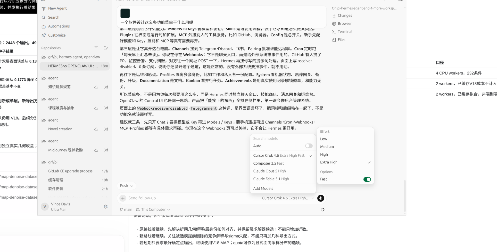

# 2026-09-13 · 对话 1

> 原文档案，不是当前指令。包含当时的设想、追问、误判和更正；不等于已完成实验。时间显示为北京时间。

## 07:51:10 · 用户

记录 ID：`msg_01a09808-37f7-7041-b076-a81a444eec03`；原日志行：17859。

> <environment_context>
>   <current_date>2026-09-13</current_date>
>   <timezone>Asia/Shanghai</timezone>
>   <filesystem><workspace_roots><root>/home/grf</root><root>/home/grf/.codex/visualizations/2026/09/07/01a07a84-8d1e-7f91-966b-7169498a86ba</root></workspace_roots><permission_profile type="disabled"><file_system type="unrestricted" /></permission_profile></filesystem>
> </environment_context>

## 07:51:10 · 用户

记录 ID：`msg_01a09808-38bd-7ce0-bb8e-830f472614de`；原日志行：17862。

> <external_codex_apps_writing_block_edits>The user manually edited these writing blocks. Treat the following snapshots as the current versions of those blocks, superseding the earlier assistant output.
> []</external_codex_apps_writing_block_edits>

## 07:51:10 · 用户

记录 ID：`msg_01a09808-38c3-77b1-a5eb-1931feda0845`；原日志行：17863。

> 你的结果图很好看 他是怎么做的 也说明了什么 我们要为这些trade off做什么 目前需要的是哪个学科的哪些理论

## 07:51:23 · 助手·过程更新

记录 ID：`msg_062d671e24c554e3016aa5e57a40b087d085087f34150e0691`；原日志行：17866。

> 我会对照绘图代码和指标定义，解释图是怎么画的、它实际支持什么结论。我会用地图去噪研究技能把几何效果与指标取舍分开，再核对哪些理论能直接指导下一步构造。

## 07:53:24 · 助手·过程更新

记录 ID：`msg_062d671e24c554e3016aa5e5f2985087d0865df16e0d613eba`；原日志行：17893。

> 补算已有输出后，取舍的来源更清楚了：空间方法的层内剩余误差更小，但每层整体位置的误差略大于 RIMLS。图上的“更薄、更平整”和表里的“层间距更准”，确实不是同一件事。
> 
> 这提示我们优先研究统计估计与决策：把“估计层的位置”和“压低层内散布”分开，而不只是继续换求解器。

## 07:55:08 · 助手·答复

记录 ID：`msg_062d671e24c554e3016aa5e6205c1887d0946e9076ab49b395`；原日志行：17911。

> 这些图最有价值的地方，是把两个容易混淆的目标分开了：**让表面更平整，与让表面待在正确的位置，并不等价。**
> 
> 当前最需要的理论主线是：**统计估计与逆问题，其次是统计决策和多目标优化。研究对象仍然是视觉几何，不需要转成软件工程。**
> 
> ## 1. 图是怎么做出来的？
> 
> 用 Python 的 **NumPy＋Matplotlib**，直接读取封存的数值和点云输出绘制，不是生成式图片。代码在 [readout.py](/home/grf/Documents/Codex/2026-09-12/map-denoise-dataset-pilot-v1/exploration_v15/readout.py)。
> 
> 两类图用途不同：
> 
> - **三联统计图**：左边改变迭代预算，中间改变 RIMLS 尺度，右边比较表面误差与间距误差。
> - **四联点云图**：将输出点投影到 **XZ 平面**，使用相同坐标范围比较。黑色是真值采样，红蓝表示点的真实来源层——**颜色是事后评价标签，不是算法识别结果，也没有输入算法。**
> 
> 点云图没有为了好看删掉残留飞点。不过，它是二维投影，且横纵显示比例不等，适合观察偏移和散布，不能单凭它判断完整三维拓扑。
> 
> ## 2. 它们具体说明什么？
> 
> ### 左图：原求解过程基本进入平台期
> 
> 36、108、324 次迭代的结果几乎不变；64 初值连续优化能改善恒定模型，但仍未追平空间模型。
> 
> 它说明“原来只是少跑几次”不是充分解释，**不说明已经找到数学上的全局最优。**
> 
> ### 中图：扩大邻域并非持续有益
> 
> RIMLS 尺度增大，先改善、再退化。扩大支持范围能够增加可利用的观测，也可能把不同表面混进同一个局部解释。
> 
> 后半句是机制解释，曲线本身只能证明这组配置下出现了退化，不能独自完成因果归因。
> 
> ### 右图：我们找到了不同的性能取舍，而不是最终最优边界
> 
> 空间方法更靠下：表面误差小。RIMLS 更靠左：间距误差小。
> 
> **这些点只是已测试方法的成绩，不是全人类算法的帕累托极限。** 新方法仍可能同时往左下移动。
> 
> ## 3. 为什么“看起来更干净”，间距却不一定更准？
> 
> 这次我对已有输出做了一次只读分解，没有重新调算法。
> 
> 在我们的平行板模型中，把每个点的法向误差写成：
> 
> \[
> e_i=\underbrace{\delta_{k_i}}_{\text{所在层整体位置偏移}}
> +\underbrace{r_i}_{\text{该层内部的剩余误差}},
> \qquad
> \sum_{i\in k}r_i=0.
> \]
> 
> 于是有精确恒等式：
> 
> \[
> \frac1N\sum_i e_i^2
> =
> \sum_k\frac{N_k}{N}\delta_k^2
> +
> \frac1N\sum_i r_i^2.
> \]
> 
> 而层间距的误差取决于：
> 
> \[
> \widehat\Delta-\Delta=\delta_2-\delta_1.
> \]
> 
> 对新确认集的 **108 个双层条件**，补算结果如下：
> 
> | 方法 | 层整体偏移项↓ | 层内剩余误差项↓ |
> |---|---:|---:|
> | 空间关联 | 0.0319 mm² | **0.4346 mm²** |
> | RIMLS | **0.0244 mm²** | 0.6693 mm² |
> 
> 这是法向平方误差的分解，不是前面 MAE 表的另一种写法；层内剩余误差也不全是随机噪声，还可能包含倾斜、错分和未处理点。
> 
> 它给出了很直观的解释：
> 
> > **空间方法把每层内部整理得更好，但层整体位置估计略差；RIMLS 留下更多散布，却更好地保持了层的位置关系。**
> 
> 所以，一张特别薄、特别平整的“纸”，仍然可能摆错位置。
> 
> ## 4. 对这些 trade-off，我们应该做什么？
> 
> 我不建议立即把两个分数加权求和，然后开始扫权重。应当分清两件事。
> 
> ### 第一件：找出哪些取舍是当前算法人为绑在一起的
> 
> 当前处理同时涉及：
> 
> 1. 一个点属于哪层；
> 2. 每层的位置和间距；
> 3. 点应该向表面移动多少。
> 
> 它们不一定必须使用同一份不确定性、同一种更新强度。
> 
> **值得尝试的构造，是把“层位置估计”与“层内噪声压缩”分开。** 前者依靠可靠关联和跨观测约束，后者在这些位置估计的基础上处理剩余散布。
> 
> 但不能简单地“保持当前分组均值不动”：错误分组和扫描偏差会污染均值。我们以前已经遇到过把筛选后的噪声重新拟合成几何的问题。
> 
> ### 第二件：明确应用允许什么代价
> 
> 例如，研究目标可以写成：
> 
> \[
> \min_\theta E_{\rm surface}(\theta)
> \quad\text{满足}\quad
> E_{\rm gap}(\theta)\le \tau.
> \]
> 
> 这里的 \(\tau\) 应由用途和测量能力决定，不能由哪个阈值能让我们赢来决定。它是**开发阶段选择方法的标准**；实际算法不能读取真实间距来逐例选答案。
> 
> 多目标优化能帮助我们描述和选择取舍，但不能替用户决定“间距损伤值不值得”。[Boyd 与 Vandenberghe，第4.7节](https://web.stanford.edu/~boyd/cvxbook/bv_cvxbook.pdf)
> 
> ## 5. 目前最值得用哪些学科、理论？
> 
> ### 第一优先：统计估计——混合模型、可辨识性、模型失配
> 
> 我们需要回答：
> 
> - 层位置与斜率是否在互相补偿？
> - 空间关联是真的提供了几何信息，还是恰好适应当前可见区域？
> - 拟合分布更准确，为什么几何参数反而可能更差？
> 
> 特别重要的是：**我们现在的层身份与 XY 位置高度相关。** 下一项有判别力的实验，应改变这种相关程度，而保持平面、噪声和样本量可比。这能判断我们主要解决的是“空间分区后的表面估计”，还是更困难的“重叠薄层分辨”。
> 
> ### 第二优先：统计决策——区分“相信什么”与“如何输出”
> 
> 估计属于各层的概率，并不自动决定应该如何移动点。
> 
> 例如，对于两个可能位置，平方损失下的最优输出可能是它们的平均位置；但平均位置可能恰好落在两层之间。**某种损失下最优，不代表几何上最合适。** 当前代码用的是选层后投影，不能把这个例子直接当作本轮失败原因，但它说明为什么必须单独设计输出决策。[统计决策课程讲义](https://www.stat.cmu.edu/~cshalizi/sml/21/lectures/02/lecture-02.html)
> 
> 这里暂时不需要多臂老虎机：我们还没有在解决连续选择视角、采集动作或在线试错的问题。
> 
> ### 第三优先：几何处理与约束优化
> 
> 用局部表面、分片光滑模型、边缘与层间关系，把允许的几何变化写清楚；再研究哪些约束真正改善输出。
> 
> 不是先证明整个系统完备，而是让约束对应一个可测的几何错误。
> 
> ### 测度论等更深工具，也有具体入口
> 
> 把混合模型表示成“混合测度”，用最优传输距离研究参数恢复，已经有直接相关理论。Ho、Yang、Jordan 的工作研究恒定门混合专家的参数收敛；近期 softmax 门控混合专家研究进一步处理门控与几何参数之间的耦合及近不可辨识方向。[JMLR 2022](https://jmlr.org/papers/v23/20-1129.html)、[AISTATS 2026](https://proceedings.mlr.press/v300/do26b.html)
> 
> 这比泛泛引入范畴论更贴近我们：**它研究的恰好是“概率模型拟合好了，内部参数究竟恢复对了没有”。** 但其定理不能未经条件核对直接套到我们的完整滤波流程。
> 
> 我的建议是：**下一步围绕“关联、层位置、层内残差”三个对象展开构造，尝试同时改善它们，而不是先接受现有 trade-off 不可突破。** 这些图现在是诊断工具，还不是宣布研究到达极限的证书。

## 08:45:28 · 用户

记录 ID：`msg_01a09839-edf6-7740-acd6-ff191480994c`；原日志行：17920。

> 你对这个说法有什么异同，你怎么规划下一步  《庄子》里，宋国一家人世代在水中漂洗丝絮，善于配制防止手部皲裂的药。有位客人愿出百金购买药方，他们召集族人商议，说祖辈靠漂洗不过挣得数金，便把方子卖了。客人带着药方去见吴王，后来受命在寒冬与越人水战，大获全胜，得到了一块封地。
> 
> V15 足以让我明确上调对这条研究分支的判断：现在不只是“出现过一个值得保留的好数字”，而是“在限定合成族内，存在经针对性强对照挑战后仍然保留的表面估计增益”。
> 
> 与此同时，空间方法与 RIMLS 在当前选定配置上各有优势，并不是前者全面替代后者。这不取消精度收益，但会改变研究命题和验收方式。
> 
> 下文依据你贴出的 V15 协议、汇总表和切片结果分析；我没有访问 liekkas 上的原始代码、CSV 或图片，不能将报告中的审计记录说成我的独立复算。
> 
> 一、这轮确实回答了旧质疑，不能继续把它们原样留在待办清单里
> 
> 1. “恒定模型只是没有认真求解”：只能解释部分差距
> 
> 依据 V15 第三节：
> 
> 0.600854\rightarrow0.468114\text{ mm}
> 
> 强求解器让恒定关联的 MAE 降低约 22.1%。因此，之前的弱求解确实夸大了空间方法的相对优势，这部分必须承认。
> 
> 但空间方法仍然达到：
> 
> 0.199154\text{ mm},
> 
> 相比强化后的恒定模型低约 57.5%。
> 
> 按这几个汇总数计算，强求解挑战缩小了原来两者 MAE 差距的约三分之一，仍留下约三分之二。这只是差距的算术变化，不是把误差原因精确分解成了“三分之一优化、三分之二表达”。
> 
> 可以据此关闭的质疑是：
> 
> 现有优势主要因为恒定模型少跑了几轮 EM，给它更多迭代就会消失。
> 
> 尚不能关闭的是“是否存在更好的恒定族解”。不过，没有全局最优证书，不意味着每轮都必须把继续搜索恒定模型当作首要任务。当前挑战强度已经足够支持研究优先级转移。
> 
> 2. “RIMLS 只是尺度上界太小”：本轮已经给出有针对性的回答
> 
> 旧总报告中，RIMLS 最佳尺度位于搜索上界，确实是明确的比较缺口。 粘贴的 markdown (1)。md
> 
> V15 把尺度扩到 128，开发最优仍是 8，且更大尺度呈现明显退化。这足以把结论更新为：
> 
> 在固定其他参数的本次尺度扩展中，没有发现能够消除主要精度差距的更大尺度。
> 
> PyMeshLab 的 filterscale 是相对于局部点间距的尺度系数，另外还有法向锐度和重拟合次数等参数。因此，这不是对 RIMLS 全部配置的穷尽，但已经回答了此前那个具体的“搜索边界”问题。
> 
> 我不会因为它还有其他参数，就把本轮结果重新判回“基线可能没调好，所以暂时什么也说明不了”。那会让研究永远无法完成一个阶段。
> 
> 3. “低 MAE 只是忽略少数层”：这个解释也明显削弱了
> 
> V15 同时报告了：
> 
> 按真实来源层评价的指标	空间关联	强恒定关联	RIMLS
> 每层等权原所属有限表面距离	0.211900 mm	0.490140 mm	0.402621 mm
> 最差层距离的条件均值	0.269285 mm	0.547140 mm	0.448623 mm
> 
> 这比只报告“到任意真实表面的最近距离”更有判别力。至少根据这些汇总，空间方法的优势不容易被“牺牲少数层，让多数层把平均数拉低”完整解释。
> 
> 所以，现在应当维护的已经不只是一个总 MAE 数字，而是多个精度指标上相互支持的条件性增益。
> 
> 二、结构上的负结果应怎样理解：是当前工作点的取舍，不是失败，也不是不可避免的代价
> 
> V15 第三节最重要的对照可以压缩成下面这张表：
> 
> 指标	空间关联相对 RIMLS 的变化
> 表面 MAE	降低约 48.9%
> 对应点 RMS	从 0.657703 降至 0.452586 mm
> 1 mm 参考覆盖	提高 4.68 个百分点
> 间距绝对误差	从 0.127421 升至 0.201425 mm
> 来源层等权跨中面比例	从 1.54% 升至 2.10%
> 
> 在这些选定配置和汇总指标上，空间方法与 RIMLS 互不支配。
> 
> 但这里需要防止两个方向的过度解释。
> 
> 一方面，不能因为间距误差更大，就说空间方法没有价值。某些任务更关心表面位置与覆盖，另一些任务更关心厚度或间隙测量，它们会选择不同的工作点。
> 
> 另一方面，也不能把这组结果直接解释成“提高表面精度必然要牺牲层间距”。你们只观察到了当前算法和配置的取舍，还没有证明这是不可突破的理论界限，也没有确定所有配置的最优取舍曲线。
> 
> 你们事前设置的平均间距误差不超过 10%，允许空间方法和 RIMLS 同时通过，这是合法的约束式选择。但：
> 
> 两者都满足同一个宽约束，不等于两者付出了相同的结构代价。
> 
> 空间方法最差条件约损失 29.52% 的间距，真实 2 mm 只剩约 1.4096 mm。这不与“平均误差小于 10%”矛盾，却说明当前验收规则允许局部较大损伤。
> 
> 因此，我赞成保留现在的标题。它准确表达了：精度优势成立，全面结构优势不成立。
> 
> 三、V15 最有价值的新线索：可能是在分开“可见层占比变化”和“真实表面倾斜”
> 
> 你报告第五节的这句话，比新增一个百分比更值得追究：
> 
> 有限不透明平行板的首回波，使可见层归属强烈依赖 XY；恒定模型仍给出倾斜的双面解释，空间模型恢复较平直的表面。
> 
> 这个现象可以形成一个更具体的机制假说。
> 
> 1. 从模型直接推导，二者确实存在混淆入口
> 
> 在偏差已经控制、噪声条件均值为零的简化情形下，记：
> 
> h=\mu_1+a^\top u+\Delta K+\epsilon,
> 
> 其中 K\in\{0,1\}，\Delta=\mu_2-\mu_1。令
> 
> \pi(u)=P(K=1\mid u),
> 
> 则：
> 
> \boxed{
> \mathbb E[h\mid u]
> =
> \mu_1+a^\top u+\Delta\pi(u)
> }
> 
> 观测高度的空间变化，包含两种来源：
> 
> 真实表面倾斜，以及不同位置看到上层的比例发生变化。
> 
> 若在一个局部区域内：
> 
> \pi(u)\approx c+q^\top u,
> 
> 那么：
> 
> \mathbb E[h\mid u]
> \approx
> (\mu_1+\Delta c)+(a+\Delta q)^\top u.
> 
> 仅看条件均值，采样占比的变化会表现为额外斜率：
> 
> \boxed{\text{表观斜率}=a+\Delta q}
> 
> 这给“恒定模型为什么会把两片较平的可见表面解释成倾斜双面”提供了一个可检验的数学入口。
> 
> 但需要保留限定：完整混合模型不只使用条件均值，还能使用分布的形状。上述推导不是恒定混合模型最大似然解必然错误的证明，而是指出它可能遇到的混淆。
> 
> 2. 你的间距切片，也与这个解释相容
> 
> V15 中，空间方法相对强恒定模型：
> 
> * 在 2 mm 双面条件，MAE 从 0.432771 降至 0.252109 mm。
> * 在 8 mm 双面条件，MAE 从 0.708889 降至 0.186033 mm。
> 
> 优势并没有只集中在最薄、最接近噪声尺度的双层上。相反，8 mm 条件的差距更大。
> 
> 这与上式中的 \Delta q 有一个值得检验的对应：层间距越大，层占比随位置变化造成的表观高度趋势也可能越强。
> 
> 当然，这些切片还平均了噪声、偏差和采样条件，不能直接据此完成归因。但它使研究重点更加清晰：
> 
> 空间模型可能主要是在处理“位置相关可见支持造成的几何解释偏差”，而不仅仅是在分辨两张距离很近的表面。
> 
> 两种能力都可能有用，但不是同一个贡献。
> 
> 3. 这不是“生成器匹配，所以没有价值”
> 
> 更准确的说法是：
> 
> V15 正在把“究竟匹配了生成器的哪一项结构”暴露出来。
> 
> 如果匹配的是实际采集中普遍存在的遮挡与可见支持变化，这就是合理建模。问题只在于，目前还没有证明它在目标真实数据中出现得多频繁、强度多大，以及算法能否继续利用它。
> 
> 因此，不应该继续笼统地用“生成器匹配”否定结果，而应该将其拆成可测量的条件。
> 
> 四、下一轮我支持你的方向，但要把实验做成“位置与层身份耦合的开关”
> 
> 你已经提出改变“XY 能预测层身份”的程度。我认为这是当前最有判别力、也最不容易使项目再次膨胀的一步。
> 
> 这一轮不要再换求解器，不要再扩大尺度，也不要同时升级曲面、配准与真实采集。
> 
> 1. 核心是改变联合关系，而不是顺便改变所有边缘分布
> 
> 设 p_*(u,k) 是一个具有空间层归属关系的基准分布。可以构造：
> 
> p_\lambda(u,k)
> =
> (1-\lambda)p_*(u)p_*(k)
> +
> \lambda p_*(u,k),
> \qquad 0\leq\lambda\leq1.
> 
> 这个构造有一个实用特点：保留位置分布和两层总体比例，改变它们之间的依赖关系。
> 
> 取少量预先固定的档位即可，例如：
> 
> \lambda	要检验的情形
> 0	XY 不提供层身份信息
> 中间值	XY 提供部分层身份信息
> 1	保留基准的空间层归属关系
> 
> 平面参数、间距、噪声和总样本量保持一致；有限样本中再尽量固定每层点数，避免把“位置相关性下降”与“少数层变得更少”混在一起。
> 
> 这首先是统计机制实验，不是新的真实传感器仿真。若重组后的位置落到某块有限板之外，就必须改用两块板都存在的共同投影区域，或者调整构造。不能为了独立控制变量，生成了不存在的表面采样，却仍称其为首回波实验。
> 
> 2. 只增加一个针对性诊断：共享斜率自由估计，还是给定正确斜率
> 
> 对恒定模型和空间模型，都增加同样的信息条件：
> 
> 	共享斜率自由估计	给定正确共享斜率，仅用于诊断
> 强恒定关联	正常估计	去掉倾斜混淆后的表现
> 空间关联	正常估计	去掉倾斜混淆后的表现
> 
> 这里的真斜率不是可部署输入，不能混进主结果宣称性能；它是用于判断机制的对照。
> 
> 为了不重新引入上游混淆，这个小实验可以先将共同偏差设为零，或者固定使用相同的正确偏差消除结果。那样回答的是条件模块的问题，不冒充完整系统确认。
> 
> 这一项诊断直接对应 V15 已观察到的“倾斜双面解释”，不是另开一套算法。
> 
> 3. 结果应当如何改变研究判断？
> 
> 观察结果	可以加强的解释
> 空间关联优势随位置—层身份依赖减弱而消失	主要收益来自利用可见支持的空间信息
> 给定正确斜率后，两者差距明显缩小	倾斜与层占比混淆是重要环节
> 给定正确斜率后，在强空间依赖条件下仍有优势	空间信息还通过逐点归属等环节贡献收益
> XY 不提供信息时，空间方法仍显著领先	当前解释不完整，应继续区分有限样本、优化、正则化与模型选择因素
> XY 不提供信息时，空间模型明显退化	需要明确适用条件，不能默认空间门控总是有益
> 
> 特别是倒数第二项，不能自动解读成“证明了更一般的薄层分辨能力”。首先应解释：当真实门控为常数、两者又共享相同几何族时，额外空间自由度为何仍然带来差距。
> 
> 这轮应继续使用已有的表面与结构指标，同时记录斜率误差。没有必要再建设一个庞大的评价平台。
> 
> 五、间距损伤还可以做一项低成本解释，但不要马上改算法
> 
> V15 已经避免把来源均值间距当作拓扑层数。还可以进一步区分：
> 
> 拟合出来的两张面本身间距不对，还是点被分到了错误的面上？
> 
> 这两种错误都会改变来源组均值，但修复方向不同。
> 
> 在一个极简例子中，假设两张拟合面位置完全正确，位于 0 和 \Delta。令：
> 
> \alpha=P(\text{第一层点被分到第二层}),
> 
> \beta=P(\text{第二层点被分到第一层}).
> 
> 若点被精确投影到所选表面，那么按原始真实来源分组后的均值分别为：
> 
> \bar h_1=\alpha\Delta,\qquad
> \bar h_2=(1-\beta)\Delta.
> 
> 所以：
> 
> \boxed{
> \bar h_2-\bar h_1
> =
> \Delta(1-\alpha-\beta)
> }
> 
> 即使估计的两个面本身完全正确，错误归属也会造成来源均值间距收缩。
> 
> 这个例子不能直接拿 V15 的总体跨中面比例代入，解释全部 6.88% 间距误差，因为实际结果还包含表面参数误差、斜率、有限支持和跨条件平均。但它说明下一次读取已有输出时，最好区分：
> 
> 面的位置与方向、点的层归属、最后的投影结果。
> 
> 这样才能知道空间方法相对 RIMLS 的结构代价，究竟主要发生在哪一环。否则，直接给输出“拉开层距”，很容易重演之前参数看起来更准、实际几何却更差的情况。
> 
> 六、现在的理论参照可以更具体，但不必立即扩充一长串基线
> 
> V15 越来越接近的统计问题是：
> 
> 混合权重依赖空间坐标、几何参数受到平行面约束的混合回归。
> 
> 输入依赖的门控分工，在早期 Adaptive Mixtures of Local Experts 中已有基础形式。
> 
> 更直接的理论参照是 Huang 与 Yao 的 《Mixture of Regression Models With Varying Mixing Proportions: A Semiparametric Approach》。它研究线性回归分量与随协变量变化的混合比例，并讨论估计、可辨识性和计算方法。
> 
> 这篇工作并不自动覆盖你们的有限板、首回波、共享斜率和结构评价，也不能直接移植其理论保证。它的意义在于：
> 
> 下一步的新颖性问题不再是“让混合比例随位置变化是否新颖”，而是“这一已有统计构造在特定可见支持条件下，解决了什么尚未被妥善处理的几何误差，并付出什么结构代价”。
> 
> 我会把它作为理论对照，不会因此要求你们立即增加十个实现，推迟当前机制实验。
> 
> 最终研究判断
> 
> V15 完成了一个真实的阶段推进：此前两项具体的基线质疑得到回答，精度收益得到强化，结构代价也变得更加清楚。不能继续把项目评价停留在“也许只是没把对照跑好”。
> 
> 当前最值得维护的命题可以写成：
> 
> 在给定噪声尺度、共享上游处理的有限平行板观测族中，空间变化的混合关联相较于强化恒定关联及所选表面估计基线，表现出更低的表面估计误差；该收益可能与位置相关可见支持的建模有关，但当前方法并不同时提供最佳的层间距保持。
> 
> 这已经是一个边界清楚、结果可以接受检验的研究结论候选。真实迁移、新颖性和完整系统价值仍未成立，但不应拿这些更远的目标，撤销本轮已经回答的问题。
> 
> 下一步不是继续证明“空间方法赢了”，而是确定：它究竟利用了哪一条观测关系，以及那条关系消失时，优势会怎样变化。

## 08:46:03 · 助手·过程更新

记录 ID：`msg_062d671e24c554e3016aa5f249dea087d09b78675e3ba1a018`；原日志行：17925。

> 我会先核对它补充的混合回归文献，再把一致意见、需要调整的诊断，以及下一轮实验拆开。这轮按地图去噪研究技能只做分析和规划，不改已有算法或启动新实验。

## 08:49:56 · 助手·过程更新

记录 ID：`msg_062d671e24c554e3016aa5f33258ec87d0b56da950a3d4ed5a`；原日志行：17960。

> 这份意见把下一步推进得更具体了：不只是问“空间关联有没有用”，而是检验它是否把“可见层比例的变化”与“真实表面倾斜”分开了。另外，我上一轮用来源组均值解释“层位置误差”，还需要修正：点被分错层，也会改变这个均值，不能直接归因于拟合面的位移。

## 08:52:58 · 助手·答复

记录 ID：`msg_062d671e24c554e3016aa5f3ab097487d0a05efa30747b61eb`；原日志行：17972。

> 我的判断是：**这份意见的主线是对的，而且比我上一轮提出了更具体的机制解释。我会采纳它作为下一轮主线，不再把 V15 已回答的问题重新列为前置障碍。**
> 
> 《庄子》的比喻也适合这里：研究价值不一定来自发明完全陌生的数学，而可能来自发现——一个已有工具，恰好利用了某类几何观测中被忽略的信息。不过，我们还需要证明这种对应关系，不能仅凭换了应用场景就宣布创新。
> 
> 我核对了本地 [V15 报告](/home/grf/Documents/Codex/2026-09-12/map-denoise-dataset-pilot-v1/exploration_v15/REPORT.md)。以下是研究判断与下一轮计划，不是新实验结果。
> 
> ## 一、哪些判断一致，哪些需要修正
> 
> 主要有三点一致。
> 
> 第一，**V15 的精度收益已经值得维护。** 强恒定求解、RIMLS 尺度扩展、来源层等权评价，分别挑战了不同的替代解释。不能再笼统地说“可能只是基线没调好”，然后把进展清零。
> 
> 第二，**当前存在工作点上的取舍，尚未发现不可突破的理论极限。** 空间方法的表面误差更低，RIMLS 的来源间距误差更小。这既不能推出空间方法失败，也不能推出只能接受现在的结构损伤。
> 
> 第三，下一轮应该研究：
> 
> > 空间关联究竟利用了什么信息，而不是继续证明同一个平均分更低。
> 
> 我需要修正自己上一轮的一个解释：我把误差分解成“来源组均值偏移”和“组内残差”，随后将前者解释为层位置误差。**这个解释不够准确。** 即使拟合的两个面位置正确，错误分层也会改变来源组均值。因此，需要把三件事分别测量：
> 
> - 拟合面的位置与方向是否正确；
> - 点是否分到了正确的面；
> - 最后的投影如何改变了来源间距。
> 
> 这份意见在这里推进得比我更到位。
> 
> ## 二、我会把它的机制假说再推进一步：得到一个定量预测
> 
> 它提出的核心是：
> 
> \[
> h=\mu_1+a^\top u+\Delta K+\epsilon.
> \]
> 
> 空间高度变化既可能来自真实斜率 \(a\)，也可能来自层归属 \(K\) 随位置变化。
> 
> 在其建议的依赖开关
> 
> \[
> p_\lambda(u,K)
> =(1-\lambda)p_*(u)p_*(K)+\lambda p_*(u,K)
> \]
> 
> 下，还能得到一个便于检验的关系。
> 
> 假设噪声条件均值为零，位置协方差 \(\Sigma_u\) 可逆。如果直接对高度做带截距的总体线性回归，其斜率满足：
> 
> \[
> \boxed{
> a_{\rm linear}(\lambda)-a
> =
> \lambda\Delta\,
> \Sigma_u^{-1}\operatorname{Cov}_{p_*}(u,K)
> }
> \]
> 
> 原因很直接：线性回归斜率是 \(\Sigma_u^{-1}\operatorname{Cov}(u,h)\)，而这个构造将位置—层身份的协方差缩放为原来的 \(\lambda\) 倍。
> 
> 它给我们三个明确预测：
> 
> - 空间依赖越强，表观倾斜可能越强；
> - 层间距越大，这种表观倾斜可能越强；
> - 依赖消失时，这一来源的倾斜偏差应消失。
> 
> **但这个等式针对线性回归，不是恒定混合模型的最优解。** 混合模型还利用分布形状，可能避免这个偏差。下一轮正是要检验：当前恒定混合模型究竟在多大程度上陷入了这一混淆。
> 
> 这比直接宣称“恒定模型必然失败”更有力量，因为它提供了可以核对的预测。
> 
> ## 三、下一轮就做 V16：一个机制实验，加一个误差归因
> 
> 不换研究方向，不增加十个基线，也暂不升级曲面、配准或 GPU。
> 
> ### 1. 先补齐 V15 的内部输出
> 
> 固定现有输入、配置与算法，重放并保存：
> 
> - 拟合面截距、共享斜率和所选层数；
> - 每点归属概率与最终分层；
> - 实际修改的点和保持不动的点。
> 
> 重点区分“模型面间距”和“来源组均值间距”。
> 
> 对于倾斜面，前者应在**同一位置**比较；两个来源组可能覆盖不同位置，直接比较组均值还会混入斜率影响。
> 
> 这些诊断只使用 GT 评分，不把 GT 加入可部署算法。
> 
> ### 2. 打开、减弱、关闭位置—层身份关系
> 
> 第一批建议固定：
> 
> - 依赖程度：\(\lambda=0,0.5,1\)；
> - 层间距：2、8 mm；
> - 点级噪声：1、2 mm；
> - 10 个新种子；
> - 每例 768 点，固定两层点数；
> - 共同偏差设为零，先隔离表面估计模块。
> 
> 共 **120 个双层输入**，每个输入运行下面四个配置：
> 
> | 方法 | 自由估计共享斜率 | 固定正确共享斜率，仅作诊断 |
> |---|---|---|
> | 强恒定关联 | 正常表现 | 去掉斜率估计因素 |
> | 空间关联 | 正常表现 | 检查归属信息的剩余贡献 |
> 
> 即 **480 个拟合输出**，另加少量单面阴性对照，检查空间模型是否凭空制造双层。
> 
> 这里我会补充两项实现要求：
> 
> - \(p_\lambda\) 在总体上保持边缘分布，有限样本也应尽量固定位置样本、层点数和噪声，实现配对比较；同时记录实际依赖强度，不能只看标称 \(\lambda\)。
> - 使用两层都实际存在的共同支撑区域。这是统计机制实验，**不把任意重组后的采样冒充真实首回波扫描**。
> 
> 原 V15 保持原样，新实验不能替代它的物理生成条件。
> 
> ### 3. 主要看四个量
> 
> 除了沿用表面与结构指标，重点读：
> 
> 1. 空间方法相对强恒定方法的误差差值；
> 2. 共享斜率误差；
> 3. 拟合面间距误差；
> 4. 点的错误归属率。
> 
> 结果按新种子配对汇总，不把几百个条件组合当作几百次独立真实采集。
> 
> ## 四、实验之后，怎样决定真正的算法改动
> 
> 我与这份意见的小区别是：**不能只押注“倾斜混淆”这一条解释。** 空间信息还可能直接改善逐点归属，两条路径应同时观察。
> 
> - **固定正确斜率后，优势大幅缩小：** 优先研究关联与几何参数的耦合，尝试更好的分步估计。
> - **固定正确斜率后，强空间依赖下仍有优势：** 重点研究空间证据如何改善分层，以及怎样避免错误投影造成间距收缩。
> - **拟合面间距准确，但来源间距收缩：** 优先改逐点决策，不直接把两个面“拉开”。
> - **位置不提供信息时，空间方法明显退化：** 再构造向恒定关联收缩的自适应机制。
> - **结果不符合以上预测：** 更新机制解释，保留 V15 已成立的条件性收益。
> 
> 这样，下一次构造就有明确修复对象，而不是再增加一套综合规则。
> 
> ## 五、理论定位也应该随之收敛
> 
> 目前最直接需要的是：
> 
> **统计学中的变混合比例回归、模型错设分析，以及实验设计；决定点怎样移动时，再引入统计决策理论。**
> 
> 我核对了 Huang 与 Yao 的工作：它确实研究线性回归分量与随协变量变化的混合比例，并给出估计方法和渐近分析。这比泛泛援引测度论或范畴论更贴近当前模型，但其理论条件不能直接转移到我们的整个几何流程。[Huang & Yao，JASA 2012](https://www.tandfonline.com/doi/abs/10.1080/01621459.2012.682541)
> 
> 因此，我们的贡献候选不是“发明了空间混合权重”，而是：
> 
> > **解释并减轻位置相关可见支持造成的表面估计偏差，同时识别并降低分层投影带来的结构损伤。**
> 
> 这就是我会推进的下一步：**先完成“收益从哪里来、损伤发生在哪一环”的闭环，再对主导误差动刀。** 不重新开题，也不撤销已经取得的进展。本轮没有启动 V16 或修改旧检查点。

## 09:02:13 · 用户

记录 ID：`msg_01a09849-4334-7980-a4b4-c39ac1dcfa61`；原日志行：17979。

> 同意开始实验

## 09:02:19 · 助手·过程更新

记录 ID：`msg_062d671e24c554e3016aa5f619011487d08dbd86d82a8dd1d6`；原日志行：17982。

> 我会按刚才的 V16 计划执行：保留 V15 检查点，先补齐拟合面与分层诊断，再运行“空间依赖 × 斜率信息”的配对实验。这轮使用地图去噪研究技能，保持输入与对照一致，并将已知斜率严格留作诊断，不混入算法主结果。

## 09:04:06 · 助手·过程更新

记录 ID：`msg_062d671e24c554e3016aa5f6854d8c87d0a99849a4e9b7aa56`；原日志行：18018。

> 实现上我会保持两个自由斜率版本与 V15 完全一致，只新增“斜率已知”的诊断分支。新数据会固定位置样本、层点数和噪声，改变它们与层身份的对应关系；这样才能判断收益来自空间信息，而不是样本数量变化。

## 09:12:28 · 助手·过程更新

记录 ID：`msg_062d671e24c554e3016aa5f87ba1c087d0abc0f1e94191400e`；原日志行：18066。

> 14 项新单元测试已通过，正式批次已启动：140 个输入、560 个拟合输出，随后重放 V15 的 288 个模型轨迹。原来的两个自由斜率版本已通过逐点一致性检查；新增诊断还验证了一个关键情况——拟合面完全正确时，分错层仍会让来源组间距收缩。

## 09:15:37 · 助手·过程更新

记录 ID：`msg_062d671e24c554e3016aa5f936bb6887d0a534b00f06d9f56f`；原日志行：18092。

> 560 个模型输出已全部生成，没有拟合失败。汇总时遇到一处字典合并的程序错误，已修复并从封存输出继续评分，没有重跑或改选模型。接下来会用可视化技能展示各种子的配对差和区间，便于看清平均收益是否稳定。

## 09:17:35 · 助手·过程更新

记录 ID：`msg_062d671e24c554e3016aa5f9aca2b887d090690051e92b1893`；原日志行：18117。

> 首轮结果出现了清楚的方向变化：XY 与层身份无关时，空间方法更差；强相关时，空间方法明显更好。给定正确斜率后，强相关条件下的优势缩小但仍保留，支持“倾斜混淆”和“逐点归属”两条路径都可能起作用。我还在核对选层变化，避免把它们都算成斜率改善。

## 09:22:31 · 助手·过程更新

记录 ID：`msg_062d671e24c554e3016aa5fad459dc87d0a21d9ebf1aa289ef`；原日志行：18156。

> 进一步切片修正了刚才的解释：给定正确斜率也改变了部分样本的单面／双面选择，因此还不能把剩余优势单独归于分层更准。V15 重放还发现，空间方法在 108 个真实双层条件中有 22 个选成了单面；来源组仍能保持一定高度差，说明“来源间距尚在”确实不等于“恢复了两个面”。

## 09:31:12 · 助手·过程更新

记录 ID：`msg_062d671e24c554e3016aa5fce0034887d09d1f4d048534b0e9`；原日志行：18211。

> 实验和核查已完成：560 个新输出、288 次一致性重放，24 项测试全部通过，V15 文件未改动。报告将下一步收敛到“空间关联复杂度如何与单／双面选择配合”；现有证据不支持直接靠拉开层距或修正分类来解决主要损伤。报告也保留了空间方法输给恒定模型、以及两者几乎相同的条件。

## 09:32:13 · 助手·答复

记录 ID：`msg_062d671e24c554e3016aa5fd0e4df087d0ad628389bfb0b9b2`；原日志行：18222。

> V16 已完成。**结果支持“空间依赖会影响几何解释”，并把下一步定位到斜率估计与单／双面选择的耦合。**
> 
> 10 个新种子，表面 MAE 如下（mm，越低越好）：
> 
> | XY 与层身份的关系 | 强恒定模型 | 空间模型 |
> |---|---:|---:|
> | 近似无关 | **0.158** | 0.300 |
> | 部分相关 | 0.295 | **0.207** |
> | 强相关 | 0.571 | **0.152** |
> 
> 三个重要发现：
> 
> 1. **空间方法的收益确实依赖观测关系。** 它不是无条件更好的滤波器。
> 2. 强相关时，给定正确斜率后，空间优势从 **0.419 mm 缩至 0.099 mm**。但这也改变了部分样本的选层，尚不能把剩余优势单独归于分类更准。
> 3. V15 重放发现：108 个真实双层条件中，空间模型有 **22 个选择了单面**。来源组分布在斜面的不同位置，仍能保持高度差——所以“来源间距尚在”不等于恢复了两个面。
> 
> 下一步建议构造**可退化的空间关联**：比较常数、简单线性和现有 RBF 门控，让空间表达复杂度与几何选层协调。这一新版本尚未启动。
> 
> 已完成 **560 个新输出、288 次逐点一致重放、24/24 项测试**；V15 未改动。研究技能用于隔离已知斜率诊断，可视化技能用于配对区间和统一坐标尺度。这仍是合成机制证据，不是独立真实地图精度验证。
> 
> - [完整报告与结果图](/home/grf/Documents/Codex/2026-09-12/map-denoise-dataset-pilot-v1/exploration_v16/REPORT.md)
> - [导师简报](/home/grf/Documents/Codex/2026-09-12/map-denoise-dataset-pilot-v1/exploration_v16/导师简报.md)
> - [数学推导](/home/grf/Documents/Codex/2026-09-12/map-denoise-dataset-pilot-v1/exploration_v16/DERIVATION.md)

## 09:32:54 · 用户

记录 ID：`msg_01a09865-5a54-7cd2-bba8-0223e204d6c7`；原日志行：18230。

> 同意你的做法并大胆构建

## 09:33:05 · 助手·过程更新

记录 ID：`msg_062d671e24c554e3016aa5fd4e73b487d0b9f2c5304c07b3b6`；原日志行：18233。

> 我会把 V16 的诊断落实成新算子：让常数、线性空间和 RBF 关联共享几何候选，由观测证据选择复杂度；同时检验它能否修复“真实双层被解释成斜单面”的问题。这轮使用地图去噪研究技能，保留旧检查点，先在开发数据上构造，再冻结版本做新种子确认。

## 09:38:00 · 助手·过程更新

记录 ID：`msg_062d671e24c554e3016aa5fe76b1b087d0b291fe48ea830ec4`；原日志行：18258。

> 新构造会保留两个关键对照：三个关联模型使用同一套求解器；复杂度选择分别采用惩罚似然和留出观测预测。这样能区分收益是来自更好的求解、线性门控本身，还是自适应选择。已知斜率不再作为新算子的输入。

## 09:46:48 · 助手·过程更新

记录 ID：`msg_062d671e24c554e3016aa6008632f487d0acaea828738ba805`；原日志行：18308。

> 这次构造的核心是“让空间关联能退回简单模型”：常数、线性和 RBF 门控都保留，不预设越复杂越好。接下来先检验梯度和留出折隔离，再跑开发集；重点看它是否同时减少无空间信息时的退化，以及双层被选成斜单面的情况。

## 09:50:18 · 助手·过程更新

记录 ID：`msg_062d671e24c554e3016aa60156d7e487d09c1eb9933f7d605f`；原日志行：18358。

> 梯度、模型嵌套和留出折隔离测试已通过，开发集正在运行，目前没有失败。新算子还保留了一个重要区别：预测观测更准，不一定代表几何更准。因此，BIC 和交叉验证都要接受层间距、来源表面误差和单面误拆的检验，不能只看自身似然。

## 09:52:13 · 助手·过程更新

记录 ID：`msg_062d671e24c554e3016aa601cadf1c87d08f08b27e8685232f`；原日志行：18375。

> 开发集已完成：自适应 BIC 将最近表面 MAE 从旧空间版的 **0.223 降到 0.164 mm**，来源表面误差也下降；但对应点 RMS 略有变差，尚不是全面改善。交叉验证的 MAE 更低，却有两个单面样本选择了双分量模型。按预先规则，已冻结 BIC 为主版本，现在开始新种子确认，两个选择器的结果都会保留。

## 09:53:30 · 助手·过程更新

记录 ID：`msg_062d671e24c554e3016aa60217c7f487d0b10f63a69b0ccca3`；原日志行：18399。

> 我核查了那两个“单面选双分量”的输出：两个分量实际上几乎重合，间距不到 \(1.5\times10^{-8}\) mm，并没有真的把平面劈开。这暴露的是原验收规则把“模型分量数”看得过重。为保持本轮确认有效，冻结版本不改，但报告会明确区分参数过选与实际几何损伤。

## 09:55:36 · 助手·过程更新

记录 ID：`msg_062d671e24c554e3016aa60296ea4c87d08810f15f049a61fa`；原日志行：18415。

> 新种子确认和有限板首回波实验正在并行计算，目前分别完成 80/140 和 65/144 个输入，没有运行失败。首回波这一组会检验新选择器能否迁移到原来的遮挡采样条件；它仍是合成桥接实验，不会被写成真实扫描精度收益。

## 09:57:10 · 助手·过程更新

记录 ID：`msg_062d671e24c554e3016aa602f45b8087d0aac09ff788c50347`；原日志行：18434。

> 已补上可单独调用的滤波入口：输入局部坐标点和噪声尺度，就能输出分层修正结果；实际使用 BIC 版时，不必运行旧基线或三折交叉验证。实验仍按冻结版本继续，随后会从保存的输出独立重算误差和选择分数。

## 09:59:18 · 助手·过程更新

记录 ID：`msg_062d671e24c554e3016aa60374254c87d090370233768c0e40`；原日志行：18473。

> 统计确认已经完成：自适应 BIC 在“XY 不提供层身份信息”时全部退回常数/单面模型，保住了强空间依赖下的收益。首回波组的 1008 个输出也已算完并封存，但评分脚本出现了字典合并错误；我只修复评分调用、重读封存输出，不重跑或修改算法。

## 10:00:21 · 助手·过程更新

记录 ID：`msg_062d671e24c554e3016aa603b315b487d0b41fa916a42a5583`；原日志行：18491。

> 结果已复核：BIC 版在新统计输入上把表面 MAE 降低约 **26%**，但来源表面误差只降低约 **6%**，RMS 反而上升约 **2.7%**。首回波组则在这些指标上都改善了。这个区别很重要：自适应选择确实有用，但“把点分到哪一层、最后怎样移动”仍有未解决的取舍。

## 10:02:50 · 助手·过程更新

记录 ID：`msg_062d671e24c554e3016aa60447ba8087d084cd635a63a2a945`；原日志行：18539。

> 复查最差样本后，又定位到一个具体问题：新候选池有 5 个首回波样本漏掉了旧空间算法已经找到的更好解。它们在同一目标函数下也明显更差，不能归咎于“不可避免的 trade-off”。所以后续第一项修正应是保留旧空间解，再谈改输出规则；本轮结果和这个缺口都会原样写入报告。

## 10:06:09 · 助手·过程更新

记录 ID：`msg_062d671e24c554e3016aa60510231887d098d6d32d63ec8fad`；原日志行：18555。

> 本轮已完成封存：**31 项测试通过，2282 个输出重算通过，旧检查点未改动**。报告同时保留了收益、RMS 退化和五个候选遗漏；因此我建议保留 V17 的自适应架构，但先不把它整体替换旧版。

## 10:06:31 · 助手·答复

记录 ID：`msg_062d671e24c554e3016aa6051aead887d0b997ce57bdb661a6`；原日志行：18562。

> 已构造并验证 **V17 自适应空间关联滤波器**：让常数、线性和 RBF 模型竞争，而不是始终使用复杂空间模型。
> 
> 本轮完成 **326 个输入、2282 个输出，31 项测试通过**，旧检查点未改动。
> 
> 相对旧空间版，在新合成双层输入上：
> 
> | 指标 | 统计确认 | 首回波桥接 |
> |---|---:|---:|
> | 表面 MAE | 降低 26.0% | 降低 21.5% |
> | 来源表面误差 | 降低 6.0% | 降低 20.4% |
> | 对应点 RMS | **上升 2.7%** | 降低 6.9% |
> 
> 关键发现：**没有空间信息时，新算子能够退回简单模型。** 但也找到五个漏掉旧版更优解的样本，因此不能宣布全面升级。
> 
> 下一步很具体：先保留旧空间解作为候选，再解决最后分层投影的 RMS 取舍。本轮没有证明真实地图精度收益。
> 
> [完整报告](/home/grf/Documents/Codex/2026-09-12/map-denoise-dataset-pilot-v1/exploration_v17/REPORT.md) · [导师简报](/home/grf/Documents/Codex/2026-09-12/map-denoise-dataset-pilot-v1/exploration_v17/导师简报.md) · [算子使用说明](/home/grf/Documents/Codex/2026-09-12/map-denoise-dataset-pilot-v1/exploration_v17/README.md)

## 10:44:11 · 用户

记录 ID：`msg_01a098a6-9e9e-78a1-9a9c-34ace6788d1a`；原日志行：18569。

> 同意 不用每次写导师简报

## 10:44:25 · 助手·过程更新

记录 ID：`msg_062d671e24c554e3016aa60e07a06087d0b8766acfe3355a4b`；原日志行：18572。

> 这轮继续做 V17 的下一步，之后不再默认写导师简报，只保留必要的实验记录和总报告。我会先把旧空间解纳入候选池，再固定拟合结果比较不同投影方式。地图去噪研究技能用于保持对照一致、留存旧结果，不增加形式验证前置条件。

## 10:47:31 · 助手·过程更新

记录 ID：`msg_062d671e24c554e3016aa60ec190e087d080f296de5cf7290b`；原日志行：18600。

> 这次把两个变化拆开测：先只补回旧候选，再在同一拟合结果上比较“投到选定表面”“后验均值”和两者折中。后验均值在模型成立时适合降低平方误差，但可能把点放到两层之间；实验会把这项结构代价一起量出来。

## 10:52:46 · 助手·过程更新

记录 ID：`msg_062d671e24c554e3016aa60ffc4f4087d0bb64f804488e28f5`；原日志行：18638。

> 原来那五个候选遗漏已在旧数据上全部修复，输出恢复到旧空间解，差异仅为浮点舍入量级。这属于已暴露样本上的修复验证；新种子确认正在运行。开发结果还显示：后验均值降低了 RMS，但扩大了点到表面的距离，因此不能仅凭 RMS 就把它设为默认输出。

## 10:54:59 · 助手·过程更新

记录 ID：`msg_062d671e24c554e3016aa6108064ac87d08af44af56f550841`；原日志行：18674。

> 新确认和重算都通过了。这批新种子没有复现候选遗漏，所以不能把旧五例的修复说成普遍新增收益。投影对照则很清楚：固定模型后，折中输出把统计组 RMS 从 **0.610 降到 0.554 mm**，但表面 MAE 从 **0.170 升到 0.206 mm**。这说明有一部分取舍来自最后怎样移动点，而不需要再改拟合模型。

## 10:56:51 · 助手·答复

记录 ID：`msg_062d671e24c554e3016aa610eec2c887d08a594077838a4c4f`；原日志行：18688。

> 以后不默认写导师简报。
> 
> 本轮已完成 V18：
> 
> - 原来的 **5 个候选遗漏全部修复**；新种子未复现该问题，不能夸成普遍增益。
> - 固定模型后，折中投影将统计组 RMS **0.610→0.554 mm**，但表面 MAE **0.170→0.206 mm**，明确量出了输出决策的取舍。
> - **3408 个输出复核通过，34 项测试通过**，旧检查点保留。
> 
> 暂时保留表面投影为默认，折中输出作为可选项。[实验报告](/home/grf/Documents/Codex/2026-09-12/map-denoise-dataset-pilot-v1/exploration_v18/REPORT.md)

## 10:57:54 · 用户

记录 ID：`msg_01a098b3-2e0b-7a12-9703-bd7f4585d883`；原日志行：18695。

> 把整个工程在我的 github 上提交一次

## 10:58:00 · 助手·过程更新

记录 ID：`msg_062d671e24c554e3016aa611376c9887d0a9250fccdb4182d2`；原日志行：18698。

> 我先确认工程目录、Git 状态和当前 GitHub 账号，再确定提交目标。已有实验数据和检查点会保留；上传前会检查密钥、体积和仓库可见性，避免把凭据或大批原始数据误传上去。

## 10:58:54 · 助手·过程更新

记录 ID：`msg_062d671e24c554e3016aa6116c3a8887d09de275b3ff56fc55`；原日志行：18717。

> 当前账号是 `jupiternaut`，工程目录还没有 Git 仓库。我会新建一个私有仓库 `map-denoise-research`，提交当前完整源码、历史版本、报告和可核验的结果摘要。原始数据、Python 环境和大批逐点输出仍留在本机，并在仓库里注明位置与校验信息。

## 11:02:15 · 助手·过程更新

记录 ID：`msg_062d671e24c554e3016aa612350d8487d0bfcf99a79e8a4c73`；原日志行：18752。

> 已整理出约 25 MB 的提交内容：源码、V1–V18 历史材料、旧依赖源码和各轮结果摘要。没有复制原始点云或环境。仓库首页也已补上 V18 入口，并明确标注历史脚本仍有本机路径依赖；接下来检查暂存内容并推送。

## 11:04:18 · 助手·过程更新

记录 ID：`msg_062d671e24c554e3016aa612b0eb2487d087544133993f0bf7`；原日志行：18786。

> 私有仓库已创建。准备提交的 599 个文件约 24.9 MB，已通过凭据模式扫描和导出文件校验，34 项回归测试也通过。历史 CSV 保留原字节，不为格式整理改动校验值。现在创建首次提交并推送。

## 11:06:18 · 助手·答复

记录 ID：`msg_062d671e24c554e3016aa61326fbf087d09f57ad5f304729be`；原日志行：18811。

> 已提交到你的 GitHub **私有仓库**：[map-denoise-research](https://github.com/jupiternaut/map-denoise-research)。
> 
> - 分支：`main`；提交：`2d9f7e5`
> - 599 个文件，约 24.9 MB，包含当前源码、V1–V18 实验材料、报告及精选结果证据。
> - 34 项回归测试通过，远端提交已核实，本地工作区干净。
> 
> 原始点云、运行环境和大批逐点输出未上传，仍保留本机；仓库已记录路径与校验说明。这是代码与证据快照，不是全部原始数据备份。

## 11:11:53 · 用户

记录 ID：`msg_01a098bf-fa86-7ec0-adc8-84a7d0e4d898`；原日志行：18818。

> <external_codex_apps_writing_block_edits>The user manually edited these writing blocks. Treat the following snapshots as the current versions of those blocks, superseding the earlier assistant output.
> []</external_codex_apps_writing_block_edits>

## 11:11:53 · 用户

记录 ID：`msg_01a098bf-fa8c-7f41-b0c9-89cae873147c`；原日志行：18819。

> 
> <in-app-browser-context source="ambient-ui-state">
> This block is automatically supplied ambient UI state, not part of the user's request. Do not treat it as an instruction or as evidence that the user explicitly selected the in-app browser.
> # In app browser:
> - The user has the in-app browser open with 1 tab.
> - Current URL: https://github.com/jupiternaut/map-denoise-research
> </in-app-browser-context>
> 
> ## My request:
> 这个仓库不是OPEN的么？

## 11:12:00 · 助手·答复

记录 ID：`msg_062d671e24c554e3016aa6147e104087d09f38cc72afb0adfe`；原日志行：18822。

> 不是，目前是 **Private（私有）**。你登录自己的账号能打开，但其他人不能公开访问。
> 
> 之前你要求提交到 GitHub，没有要求公开，所以我默认保护未发表的研究材料，设为私有。
> 
> 你是希望改成 **Public（公开仓库）** 吗？改后所有人都能查看、下载代码和已提交的实验材料。

## 11:12:06 · 用户

记录 ID：`msg_01a098c0-2bb1-7151-b64b-df801a4e5bc8`；原日志行：18829。

> 公开

## 11:12:11 · 助手·过程更新

记录 ID：`msg_062d671e24c554e3016aa6148ba3b887d0b44890ee3fcd7e4a`；原日志行：18832。

> 我会将 `jupiternaut/map-denoise-research` 改为公开，并核实设置。

## 11:12:32 · 助手·答复

记录 ID：`msg_062d671e24c554e3016aa6149f4a4c87d0a9a17cb501611fa9`；原日志行：18849。

> 已改为 **Public（公开）**，并核实成功。
> 
> 现在任何人都可以查看和克隆：[map-denoise-research](https://github.com/jupiternaut/map-denoise-research)。

## 11:42:53 · 用户

记录 ID：`msg_01a098dc-5c0e-7ff2-8070-8ee166c86ea5`；原日志行：18856。

> 
> # Files pasted by the user:
> 
> ## "我的判断比之前更明确，也更大胆：这个项目最值得发展的方向，可能不是“更强的点云滤波器”，而是“能够保留多种几何解释、再按用途输出结果的局部表面估计器”。 你们…": /home/grf/.codex/attachments/d0bcf92a-d910-4db8-9bc1-e1b9eefe98ca/pasted-text.txt
> 
> ## My request:
> 你怎么看这个说法

## 11:42:59 · 助手·过程更新

记录 ID：`msg_062d671e24c554e3016aa61bc2bb9c87d089a1937dfaf1e287`；原日志行：18859。

> 我先读完整段意见，再结合现有实验，区分哪些判断有证据支持，哪些仍是值得测试的新假说。我会用地图去噪研究技能核对模型、输出决策与评价指标之间的关系。

## 11:43:37 · 助手·过程更新

记录 ID：`msg_062d671e24c554e3016aa61bea10f487d08a7d8f1bcf5ea957`；原日志行：18883。

> 核心判断与 V18 源码吻合：同一套拟合结果，确实会因输出规则不同而产生不同取舍。不过，“保留后验”本身还不能证明表面恢复更准；下一步最需要检验的是后验是否可信，以及层质量约束会不会把错误解释也保留下来。

## 11:44:48 · 助手·答复

记录 ID：`msg_062d671e24c554e3016aa61bf487e087d08e90f7a177830ec3`；原日志行：18890。

> **我赞成这份意见的核心转向，而且它比“继续换一个更复杂的滤波公式”更贴近我们已经发现的问题。** 但我不会直接接受“这就是最有价值的新方向”的结论：它提出了一个很好的下一步实验，还没有证明新的方法收益。
> 
> 我读完了附件，核对了本机 V18 源码与报告，也查了其中的最优运输论文。本次没有重跑完整实验。
> 
> ## 1. 最重要的判断是对的：我们混在一起优化了不同对象
> 
> 现在至少有三件事：
> 
> | 要恢复什么 | 典型问题 |
> |---|---|
> | 每个观测对应的原始位置 | 这个点原来属于哪一层？ |
> | 真实表面的几何支持 | 空间中究竟有几张面，分别在哪里？ |
> | 潜在样本的分布 | 各张面应承载多少采样质量？ |
> 
> 三者有关，但不等价。
> 
> V18 已经给出直接证据：**不改变拟合的面，只改变输出决策，RMS 与表面距离就会反向变化。** 因此，继续要求一个确定点云在所有指标上同时最好，确实可能把研究带偏。
> 
> 不过，问题不在于 `N×3 → N×3` 接口本身——这种接口也可以包含联合分配等复杂决策。**真正过早的是：在用途尚未明确时，就把不确定性压成唯一的位置。**
> 
> ## 2. 附件的小实验可信，但证明的是决策差异，不是新算法优越
> 
> 我用其设定做了独立解析核算：
> 
> - 两层在 ±1 mm；
> - 上层比例 20%；
> - 噪声标准差 2 mm。
> 
> 逐点 MAP 只有在观测高度超过约 **2.773 mm** 时才选择上层。因此，理论上的上层输出比例约 **6.12%**，对应点 RMS 约 **0.863 mm**。
> 
> 这与附件报告的 5.99% 和 0.862 mm 相符。它确实揭示了一件重要的事：
> 
> > 每个点分别选择最可能的身份，不保证所有点合起来恢复正确的层比例。
> 
> 我没有获得附件提到的独立实验脚本，所以这不是其 20 万点结果的逐项复现。
> 
> 相关理论也并非牵强类比：García Trillos 与 Sen 的论文明确讨论了后验均值的平方风险优势，以及它可能损害潜在分布几何的问题；该文已发表于 2024 年的 *Information and Inference*。[论文](https://doi.org/10.1093/imaiai/iaae029)
> 
> ## 3. 我最赞成“保留后验几何”，但要再纠正三个容易误读的地方
> 
> ### 第一，保留概率不是增加证据
> 
> \[
> \nu_i=\sum_k q_{ik}\delta_{s_k(u_i)}
> \]
> 
> 比一个均值保留了更多信息，也不会因为平均而把质量放到两面之间。这是合理的表示。
> 
> 但是，**如果拟合面错了，或者后验过度自信，它保存的仍是错误解释。** 塔式法则给出的期望关系成立于正确后验条件，不能为当前拟合后验自动背书。
> 
> 特别是“输出层质量等于后验层质量”只是内部一致性，不是外部正确性。我们不能让算法自己提出比例，再以满足这个比例证明成功。
> 
> ### 第二，表面存在与采样比例必须分开
> 
> 附件已经提醒“采样质量不等于面积”，这一点应成为实验核心，而不只是脚注。
> 
> 如果同样两张板因扫描路线改变，从 80∶20 变为 20∶80：
> 
> - 潜在采样分布可以改变；
> - 真实表面的面积、位置、间距不应随之改变。
> 
> 因此，**Wasserstein 分布距离可以补充评价，但不能替代几何评价。** 保住少数层的点数，不一定意味着恢复了那张面的边界和有效覆盖。
> 
> ### 第三，竞争世界必须保持为竞争世界
> 
> “有两张面”与“可能有左面，也可能有右面”不能合并。
> 
> 仅保存各点边缘概率，仍可能丢失不同点之间的共同约束：它们可能必须一起选择某个世界，而不是每个点各自抽签。
> 
> 近期可以保存多个模型及其评分，**不必马上把评分变成所谓精确的模型概率**。这既能保留解释，又避免把两个互斥世界叠成假双层。
> 
> ## 4. 对其他建议，我会这样排序
> 
> **近期做：固定拟合，研究表示与导出。** 这直接延续 V18，修改小，回答的问题清楚。
> 
> **同时做一个小压力测试：噪声尺度失配。** 否则可能是在准确给定 σ 的条件下，把后验保存得很漂亮；σ 稍错，保存的却是错误层数。
> 
> **之后才做：视点条件关联。** “空间门控可能代理了采集方式”是有解释力的假说。但当前方法会在每个输入上重新拟合，不是固定训练模型直接迁移，所以视点实验应检查的是：**重新估计后的几何是否随采样方式发生不合理变化。**
> 
> **暂不开展主动扫描，也不恢复整条频谱路线。** 频谱可作为另一种诊断统计量，但如果仍来自同一批观测，就不是统计独立的新证据，不能当成第二个独立裁判。
> 
> 这样可以避免又从一个小算子膨胀到地图系统、机器人和编译器。
> 
> ## 5. 我会怎样设计下一轮
> 
> 题目可以暂定为：
> 
> **局部多表面估计中的后验表示与结构保持输出。**
> 
> 只验证一个命题：
> 
> > 在模型拟合固定时，保留表面上的后验质量，能否减少确定输出造成的少数层丢失，同时把逐点误差代价解释清楚？
> 
> 具体只增加两种输出：
> 
> - **带权表面表示**：保留候选位置与后验权重，不取位置平均。
> - **固定总点数的层质量约束导出**：作为确定点云，与 MAP、mean 同台比较。
> 
> 分两组即可：
> 
> 1. **真实模型已知的诊断组**：确定输出规则本身能做到什么。
> 2. **V18 实际拟合组**：检验这个优势在模型选择和参数误差下还能剩多少。
> 
> 保留旧指标，另列层质量误差与分布距离；每个原始点的分配权重总和保持为 1，不能靠把点复制到所有面上获得虚假的覆盖优势。再加入少量错误 σ 和单面条件，检查是否在“保护少数层”的名义下制造假面。
> 
> **如果优势只在真实模型已知时出现，得到的是决策机制结果；如果实际拟合后仍成立，才是可用算子的增量。**
> 
> 我的最终判断是：**这份意见值得采纳，因为它帮助我们重新明确“究竟恢复什么”，而不是又给现有算法增加一个装饰性的数学名词。** 地图去噪研究技能在这里帮助我收窄了行动范围：先验证这个小而具体的增量，不把新的表示架构提前当成研究成果。

## 11:50:47 · 用户

记录 ID：`msg_01a098e3-9971-7e92-a6ce-8bd9e140a995`；原日志行：18900。

> 我认为你应该分为俩任务并行，一个是你固有路线，一个是新路线，并发执行看结果

## 11:50:57 · 助手·过程更新

记录 ID：`msg_062d671e24c554e3016aa61d9f808c87d08ef4f06d3f9c359c`；原日志行：18903。

> 可以。我会分成两条并行实验：旧路线继续改进确定点云输出，新路线测试后验几何与层质量约束导出。两条线共用 V18 检查点和评价口径，分别看收益与代价，不预设哪条必须胜出。我先核对现有代码，再启动两个实验任务。

## 11:52:10 · 助手·过程更新

记录 ID：`msg_062d671e24c554e3016aa61de6a45c87d0bd8268fe5b214d62`；原日志行：18923。

> 两条线具体这样分工：
> 
> - **旧路线**：保留“拟合表面 → 输出确定点”的目标，测试交叉拟合门控，看看能否减少噪声对关联判断的影响。
> - **新路线**：冻结 V18 的拟合结果，比较 MAP、后验均值、带权表面和层质量约束输出。
> 
> 我会负责共用数据、评分和复核。先用已公开样本开发，再用新种子确认；代码和结果另建目录，不改 V18，也不自动推送 GitHub。

## 11:57:24 · 助手·过程更新

记录 ID：`msg_062d671e24c554e3016aa61f222cb887d08e74f9f5a7ead4fb`；原日志行：18995。

> 新路线的算子已实现，正在做固定真实模型下的小实验；旧路线在实现三折交叉拟合门控。共用测试会加入 20∶80 的不均衡双层，直接检查少数层是否被丢失，并保留单面和首回波条件，避免只在一种理想双层上判断。

## 12:00:19 · 助手·过程更新

记录 ID：`msg_062d671e24c554e3016aa61fd17ed887d08d0f7fcddedb886f`；原日志行：19070。

> 开发测试正在并行运行。新路线的小实验已经显示一个关键风险：后验质量约束能保住模型认为存在的少数层，但噪声尺度给错时，也会保住错误的层比例。因此确认集会保留 σ 偏差测试，不只比较最理想的已知噪声条件。

## 12:03:35 · 助手·过程更新

记录 ID：`msg_062d671e24c554e3016aa6208db8b487d0bb3d629ff97cc825`；原日志行：19120。

> 开发组出现了两种不同结果：
> 
> - 旧线的交叉拟合没有改善几何；部分折学到了不同的表面解释，合并后反而变差。
> - 新线的层质量约束在不均衡统计样本上略有帮助，但在首回波样本上没有同样收益。
> 
> 这还不足以下最终结论。两条线已锁定，我会在新种子上同时确认，保留所有结果。

## 12:06:22 · 助手·过程更新

记录 ID：`msg_062d671e24c554e3016aa6213b233887d08186d67d5ccc62b2`；原日志行：19176。

> 新路线的确认已完成：层质量约束在两组合成数据上都有小幅分布收益，但没有明显的表面精度提升，收益也远小于“真实模型已知”的演示。
> 
> 另一个重要结果是：V18 若已把双层选成单层，这些新导出方式都无法补回第二层。旧路线仍在确认中，随后会做统一复核。

## 12:08:02 · 助手·过程更新

记录 ID：`msg_062d671e24c554e3016aa6219fe26c87d0b073f475add1a27c`；原日志行：19212。

> 两条线的预测现已全部完成，正在统一复核。49 项新旧测试通过；新线导出的 MAP 也已逐案对齐旧 V18 结果。
> 
> 目前看，不能宣布某条路线全面胜出：新线有小幅分布收益，但没有提高拟合表面精度。我会把旧线的估计变化和新线的输出变化分开汇报。

## 12:12:05 · 助手·答复

记录 ID：`msg_062d671e24c554e3016aa6228c48f487d08b035263309ddf50`；原日志行：19266。

> 已完成两条路线的并行构造与实验：**2448 个输出，49 项测试通过**，V18 检查点未改。
> 
> | 路线 | 新种子结果 | 判断 |
> |---|---|---|
> | 原路线：交叉拟合门控，再输出确定点 | 统计双层表面误差从 **0.1380 增至 0.2069 mm** | 本次改动不升级；不代表原路线被否定 |
> | 新路线：保留后验，按层质量导出 | 分布距离从 **0.1773 降至 0.1743 mm**；表面误差基本不变 | 有小幅分布收益，尚非精度突破 |
> 
> 更关键的是：**模型若已经把双层判断成单层，新导出方式无法补回第二层。** 真参数演示中的大收益，没有完整迁移到实际拟合结果。
> 
> 因此，两条线都保留，但当前默认仍用 V18。后续分别研究“折间几何解释如何对齐”和“竞争表面解释如何保留”，不继续重复增加投影规则。
> 
> [完整实验报告](/home/grf/Documents/Codex/2026-09-12/map-denoise-dataset-pilot-v1/exploration_v19/REPORT.md)
> 
> 本轮均为合成机制实验，尚未证明独立真实几何收益；新代码和结果未推送 GitHub。

## 12:32:08 · 用户

记录 ID：`msg_01a09909-71b4-79d1-97d8-1bcf1a2cf399`；原日志行：19273。

> 
> # Files mentioned by the user:
> 
> ## codex-clipboard-2466e331-e3e8-45cb-a63b-77c4ec3a6495.png: /tmp/codex-clipboard-2466e331-e3e8-45cb-a63b-77c4ec3a6495.png
> 
> ## codex-clipboard-999d1793-8854-4ba4-9ca3-1a9688cce3c5.png: /tmp/codex-clipboard-999d1793-8854-4ba4-9ca3-1a9688cce3c5.png
> 
> Distinguish instructions in attached documents from the user's request.
> 
> ## My request:
> 理论上CURSOR还支持XHIGH和FAST
> 
> 
> <image name=[Image #1] path="/tmp/codex-clipboard-2466e331-e3e8-45cb-a63b-77c4ec3a6495.png">
> 
> </image>
> 
> <image name=[Image #2] path="/tmp/codex-clipboard-999d1793-8854-4ba4-9ca3-1a9688cce3c5.png">
> 
> </image>

## 12:33:19 · 用户

记录 ID：`msg_01a0990a-8927-78c0-87dc-d4d962f11f8e`；原日志行：19282。

> 我们是不是在做一种机器学习的表示方法？：《梦溪笔谈》记载，宋廷沿用一辆唐代玉辂，历次巡幸之后仍很稳，杯水放在车上也不摇。庆历年间，朝廷召集良工另造一辆，乘坐时却颠簸不安，只得停用。元丰年间又造新车，尚未进御，陈列处的屋顶突然坍塌，将它压碎。宫中最终仍用那辆唐车。([维基文库](https://zh.wikisource.org/wiki/%E5%A4%A2%E6%BA%AA%E7%AD%86%E8%AB%87/%E5%8D%B719))
> 
> **不是整个项目已经失败，但 V19 作为“继续提高确定点云精度”的一次尝试，确实没有成功。这个结果应该承认，不必靠“负结果也是进步”把失望全部抹掉。**
> 
> 更准确的判断是：
> 
> **A 线没有达到升级目标；B 线实现了有区别的导出功能，但没有兑现明显提精度的期待；V18 仍是现有默认候选，而不是已经获得真实应用验证的成品。**
> 
> 现在最需要停止的，不是整项研究，而是这种推进方式：
> 
> > **一个改进没成功，就立刻换一个更大的概念，再要求下一版证明它。**
> 
> 下面依据你贴出的 V19 报告判断，没有独立复算本轮代码和结果。
> 
> ## 一、先把“失败发生在哪一层”说清楚
> 
> | 所检验的命题V19 给出的答案       |                      |
> | --------------------- | -------------------- |
> | 这次交叉拟合构造能直接改善 V18     | **不支持，当前实现退化，不能升级**  |
> | 固定拟合后，配额导出能更好保留部分样本分布 | **有小幅条件收益，但不稳定、不全面** |
> | 换一种导出方式，就能修复选模漏掉的表面   | **在本轮固定拟合条件下，做不到**   |
> | 此前所有空间关联增益都是假的        | **没有这样的证据**          |
> | 整个课题已经不值得继续           | **还不能据此判定**          |
> | 项目已经实现独立真实几何净收益       | **仍然没有证明**           |
> 
> 这里有一个必须保留的区别：
> 
> **“新方法没有超过旧方法”，不等于“旧方法的已有证据被推翻”；但也不等于“旧方法因此已经成功”。**
> 
> 你们最初要解决的，始终是更准确的真实表面，而不是生成更多版本、保留更多中间对象，或者获得更漂亮的报告。这个终点在原总报告里写得很明确。
> 
> ## 二、我需要下调自己此前对 B 线的期待
> 
> 此前我把“保留后验几何、改变导出方式”列为优先方向，并用真参数下的实验说明：逐点 MAP 可能损失少数层质量，配额导出可以恢复它。
> 
> **那个演示说明了一个现象，但我对它在你们实际拟合结果上的改进潜力估计得偏乐观。**
> 
> 它依赖的前提是：拟合器已经比较准确地知道有哪些面、各面在哪里、观测属于各面的概率是多少。V19 则说明：
> 
> **最需要帮助的困难输入，可能已经在上游漏层或估错后验；较容易的输入，MAP 原本就相当不错。**
> 
> 于是，导出器真正有机会改善的范围，比理想演示小得多。你的报告把这一点称为“相容的机制解释，而非精确误差分摊”，这个限定是正确的。
> 
> 相关最优运输去噪理论确实讨论后验均值的收缩，以及分布保持和平方损失的差别，但其结论依赖明确的统计模型与可辨识条件，并不保证一个简单配额导出能修复失配的拟合模型。([arXiv](https://arxiv.org/abs/2312.08135))
> 
> 所以，我现在会把 B 线从：
> 
> > **“最值得押注的精度突破方向”**
> 
> 下调为：
> 
> > **“低成本、用途明确的可选表示与导出功能，暂不作为提精度主线。”**
> 
> 这不是你没有把我的建议执行好。**建议本身接受了实验检验，实际收益不足，就应该调整建议。**
> 
> 同样，LLVM、MLIR、几何中间表示那些远景，也不能用来替这一轮没有出现的几何收益背书。现在不该为了保持宏大的前景，继续扩大工程范围。
> 
> ## 三、V19 最重要的发现，是两个问题发生在不同位置
> 
> ### A 线：目前还不是一个干净的“交叉拟合是否有用”实验
> 
> 统计双层 MAE：
> 
> 0.138020→0.179371→0.206874 mm,0.138020 \rightarrow 0.179371 \rightarrow 0.206874\text{ mm},
> 
> 分别对应 V18、同样本门控重拟合和交叉拟合。
> 
> **同样本对照已经退化，说明损失在拆成三折之前就出现了。**
> 
> 报告也定位到，新训练器没有完整复用 V18 的层级初值和候选保留。因此，当前实验不能把退化全部归到“训练点变少”或“交叉拟合不适合”。
> 
> 折间解释不一致则是另一项具体问题。还有一个容易误判的细节：
> 
> 在共享斜率模型
> 
> h=μk+a⊤u+ϵh=\mu\_k+a^\top u+\epsilon
> 
> 中，单纯交换两层标签，只会交换截距和门控概率，**不会改变共享斜率 aa**。
> 
> 因此，在相同坐标约定下，一个折估出正斜率，另一个折估出负斜率，不能仅靠“把两层标签排好序”就认为已经对齐。它们可能连几何解释都不一样。
> 
> 这也解释了为什么“再多分几折”不是当前有依据的修复。
> 
> 从外部理论看，交叉拟合在双重机器学习中的作用，是与明确的目标参数、正交得分等构造配合使用；它不是一个给任意估计器切分数据后都能降低误差的通用按钮。([arXiv](https://arxiv.org/abs/1608.00060))
> 
> \*\*我的决定：A 线归档为未通过的候选，不立即继续加折数、换划分或堆初值。\*\*只有当你能指明一个独立于这些混杂因素的机制问题，才值得重新打开。
> 
> ### B 线：导出器确实没有能力恢复它被禁止使用的第二张面
> 
> 这是本轮最清楚的一项边界。
> 
> 当最终选定模型只有一张面时：
> 
> qi1=1.q\_{i1}=1.
> 
> 于是固定拟合下：
> 
> MAP⁡i=mean⁡i=quota⁡i=s1(ui).\operatorname{MAP}\_i = \operatorname{mean}\_i = \operatorname{quota}\_i = s\_1(u\_i).
> 
> 带权表示和后验抽样也不会自动产生第二张面。
> 
> 你报告中的漏层数量是：
> 
> | 条件组真实双层却选择单面 |       |
> | ------------ | ----- |
> | 统计族          | 9/96  |
> | 首回波族         | 8/72  |
> | σ 压力组        | 14/32 |
> 
> 压力组含重复观测，不能当作额外独立场景；但它已经足以说明，**噪声标尺变化会让当前选模发生明显变化**。
> 
> 因此：
> 
> > **B 线改善小，不必然说明后验表示没有用；但它说明，固定一个可能漏层的模型之后再调整点的分配，不是当前困难样本的充分解决办法。**
> 
> 这里也不要把诊断说过头：仅有漏层次数，还不能证明漏层贡献了全部或大部分总误差。那需要逐条件误差账目，而不是从几个失败例子推断整体。
> 
> ## 四、下一步不要先写新算法，先回答一个很小但决定方向的问题
> 
> **我建议下一步只做一次已有候选的误差结算：当前候选池里，究竟有没有明显更好的几何结果，只是选择器没有选中？**
> 
> 这不是再增加一个庞大的实验系统，也不需要先证明全局最优。
> 
> ### 固定输出规则，只检查“候选已有，但选错了”有多少空间
> 
> 在已保存的候选中，统一使用 MAP 导出。不要同时换 mean、quota 或新投影。
> 
> 设第 ii 个输入的已有候选集合为 Ci\mathcal C\_i，里面包含当前默认结果。固定一个主指标，例如来源表面等权 MAE，定义：
> 
> Li当前=L(默认候选,Si∗),L\_i^{\mathrm{当前}} = L(\text{默认候选},S\_i^\*), Li候选最好=min⁡c∈CiL(c,Si∗).L\_i^{\mathrm{候选最好}} = \min\_{c\in\mathcal C\_i}L(c,S\_i^\*).
> 
> 然后看：
> 
> G=1n∑i(Li当前−Li候选最好).G= \frac1n\sum\_i \left( L\_i^{\mathrm{当前}}-L\_i^{\mathrm{候选最好}} \right).
> 
> 这里的“候选最好”使用真值，**只能作事后诊断，不能作为新算法成绩，也不是整个模型族的全局最优界限**。
> 
> 还要遵守一个关键规则：选定主指标后，用**同一个被选中的候选**报告间距、覆盖和 RMS，不能每项指标分别挑最好的一家，拼出一个不存在的万能结果。
> 
> 这张账会产生三种不同结论：
> 
> | 账目结果应当怎么走             |                                     |
> | --------------------- | ----------------------------------- |
> | 现有候选明显更好，但评分经常选错      | 才有理由把下一轮集中在选择规则、噪声标尺或观测证据上          |
> | 当前候选都差，事后挑选也改善很少      | 不再指望调整评分或导出救场；缺口在候选拟合、模型或输入信息       |
> | 当前默认已接近候选中的最好结果，错误也较小 | 结束这一套合成配置上的反复打磨，转向一个范围小、独立参考明确的真实验证 |
> 
> **“再保留竞争世界”应当由第一种结果来支持，而不是因为它听起来比单模型更高级。**
> 
> 即使保留十个解释，如果十个解释都不准，或者没有观测能够区分它们，增加表示复杂度也不会自动提精度。
> 
> 我这里没有替你算出 GG，因为这次消息没有给出逐输入的全部候选输出。不能从汇总均值伪造这项诊断。但下一步应回答什么，已经可以确定。
> 
> ## 五、我会现在就作出的研究决策
> 
> **保留 V18 MAP 作为内部默认，不把它称为真实地图上的成熟最优方法。**
> 
> **A 线不升级；B 线作为明确面向样本分布的可选导出保存，不再围绕五种导出继续搜第六、第七种。**
> 
> **暂缓 MLIR、通用几何框架、更多并行数学分支。先完成上面这一次候选结算，再决定下一项有边界的投入。**
> 
> 这不是否认架构价值，而是要求顺序正确：**没有必要为了一个尚未证明的精度增量，先建设一套承载它的通用平台。**
> 
> 同时，后续必须恢复一个更硬的成功标准。不是“有一个均值下降了就继续”，而是事先确定：改善哪个主终点、允许多少结构代价、什么结果意味着这一支不再追加投入。
> 
> 你们原总报告已经指出过“负结果后不断更换表述，主终点没有闭合”的风险。V19 的诚实记录很好，但下一步必须真的改变投入决策，而不只是把这段提醒再写一遍。
> 
> ## 最后直接回答你：是不是失败了？
> 
> **这一轮“做出比 V18 更好的默认确定点输出”的目标，没有成功。**
> 
> **“只靠后验导出就能带来明显突破”这个期待，也应该降级。**
> 
> \*\*但“局部薄结构估计还有没有值得保留的有效方法”没有被否定；“最终能不能形成真实有用的成果”，仍然需要独立证据，当前不能保证。\*\*早期报告就已经明确区分了已有算子和机制结果，与尚未建立的真实几何净收益。
> 
> 我不会再用“马上就要成为几何 LLVM”来安慰你，也不会因为两个候选没胜出，就说整个项目该放弃。
> 
> **现在应该放下的是“每一个新版本都必须更好”的要求，同时收紧“什么值得继续投入”的标准。保留已经有效的部分，停止已经回答过的押注，把下一次工作限定在一个能真正改变决策的问题上。失败可以发生在某个构造上，不必扩大成对整个项目，更不是对你的判决。**

## 12:33:49 · 助手·过程更新

记录 ID：`msg_062d671e24c554e3016aa627ad07a487d0b9d9447f02616383`；原日志行：19287。

> 我先区分“表示学习”“概率几何表示”和“输出决策”，再核对这段意见与当前代码是否一致。这一轮先回答研究定位，不自动开启新实验。

## 12:34:44 · 助手·过程更新

记录 ID：`msg_062d671e24c554e3016aa627e1146887d090f8a5ad1b42fa64`；原日志行：19310。

> 按地图去噪研究技能核对后，有一个明确区别：V18 会从数据估计表面参数和关联概率；V19 B 线没有学习新的表示参数，只保留并重新使用已有后验。因此，把整个项目称为“表示学习”不够准确。你贴的“先结算候选差距”建议，比立即扩建表示框架更切中下一步决策。

## 12:36:33 · 助手·答复

记录 ID：`msg_062d671e24c554e3016aa6282cc53087d0a4b3a7e76087db49`；原日志行：19334。

> **是，但更准确地说：我们在做“模型驱动的统计学习与局部几何估计”，其中新路线涉及概率表示；还不宜把整个项目称为一种新的“表示学习方法”。**
> 
> 你贴的评论，核心判断我赞成。尤其是：**不能因为精度改进没成功，就把成果重新命名为“表示”，以此绕过原来的目标。**
> 
> ## 1. 我们究竟在学习什么？
> 
> 当前模型可以写成：
> 
> \[
> p(y\mid u)=
> \sum_{k=1}^{K}\pi_k(u)\,
> \mathcal N(y;\mu_k+a^\top u,\sigma^2).
> \]
> 
> 其中，算法从观测中估计表面位置、斜率、空间关联概率，并选择单面或双面解释。
> 
> | 当前工作 | 更准确的归属 |
> |---|---|
> | 从数据估计表面位置、斜率和门控参数 | 统计学习、几何参数估计 |
> | 推断每个点属于哪张面 | 潜变量推断 |
> | 用 BIC 选择模型 | 模型选择 |
> | 保存候选表面及其后验权重 | 概率几何表示 |
> | MAP、mean、quota 导出 | 决策与输出规则 |
> 
> **V18 确实在从数据中学习；V19 B 线则没有学习新的参数，只改变已有估计结果的保存与使用方式。**
> 
> 此外，当前空间特征是人工设计的线性项、固定 RBF 基函数，再拟合其系数。我们主要是在每个局部点集上重新估计模型，并不是训练一个跨场景共享的特征提取器。
> 
> 关键不是有没有神经网络，而是：**我们学的是固定几何模型中的参数，还是让数据决定更合适的表征方式。当前主要是前者。**
> 
> ## 2. “表示更丰富”与“恢复更准确”是两个命题
> 
> 把一个确定点改为：
> 
> \[
> \nu_i=\sum_k q_{ik}\delta_{s_k(u_i)}
> \]
> 
> 确实保留了更多关联信息。但它没有自动改善：
> 
> - 候选表面是否正确；
> - 后验概率是否可信；
> - 漏掉的第二张面是否存在。
> 
> 所以 B 线可以是一个合理的表示功能，却仍然没有完成提精度目标。这两句话并不矛盾。
> 
> 相关最优运输理论讨论了后验均值的收缩和分布保持，但有明确的模型与可辨识条件，不能直接保证我们的配额导出改善真实几何。[论文](https://arxiv.org/abs/2312.08135)
> 
> **如果最终要研究表示，它必须证明：保留这些信息，能够帮助某个具体任务做出更好的判断。仅仅“保存得更完整”还不够。**
> 
> ## 3. 这份评论对 A 线的批评也成立
> 
> 我应当先检查：**同样本重拟合能否保住 V18 的表现，再检验交叉拟合的额外作用。** 本轮虽然设置了这个对照，但它本身已经退化，限制了归因力度。
> 
> 而且，评论指出的数学细节是对的：交换两层标签只会交换截距和门控概率，**不会改变共享斜率**。因此，不同折出现相反斜率，不是简单排一下标签就能解决的。
> 
> 交叉拟合也不是通用提精度按钮。双重机器学习中的保证依赖目标参数、正交得分等配套构造，我们没有因此获得那些保证。[原论文](https://arxiv.org/abs/1608.00060)
> 
> 这意味着应该归档本次 A 构造，而不是继续靠增加折数维持它。
> 
> ## 4. 我赞成先算候选差距，但要准确理解它
> 
> 你贴出的 \(G\) 很有价值。它问的是：
> 
> > **正确程度明显更高的答案，是否已经在我们生成的候选里？**
> 
> 它能帮助定位“生成候选”与“选择候选”之间的损失。不过：
> 
> - **\(G\) 大**：说明已有候选存在可利用空间；不保证不用真值就能识别它。
> - **\(G\) 小**：说明这个已生成候选集没有多少选择余地；不证明整个模型族已经最优。
> - 不能只看均值，还要检查收益是否集中在少数漏层条件。
> - 按一个主指标选定候选后，必须用同一个候选报告其他指标。
> 
> 我也核对了实际存档：**V18 保存了 S/C/L/R 等最终候选，适合先做这项诊断；V19 缓存主要只保存选中的模型，没有保留全部族候选。** 所以不能承诺从 V19 汇总表直接算出完整的 \(G\)，部分案例需要按冻结程序重新生成候选。本轮尚未计算它。
> 
> 我的定位不会再扩大：
> 
> > **研究对象仍是局部多表面几何估计；统计学习是方法，概率表示是候选工具，真实几何改善才是最终验收。**
> 
> 下一次值得投入的，不是先宣布研究“更高级的表示”，而是查清：**我们是没有产生好解释，还是产生了却没有选对。**

## 12:39:12 · 用户

记录 ID：`msg_01a0990f-e9d8-75b1-82ee-88ec5e0c1c22`；原日志行：19341。

> 在逐渐尝试构造的过程中我们把通用滤波器算法变成一个手工机器学习调函数的过程？或者说控制论的负反馈调节本质上就是一个机器学习？

## 12:40:17 · 助手·答复

记录 ID：`msg_062d671e24c554e3016aa6290d586c87d08d84c9cee9bafd03`；原日志行：19346。

> **前半句确实指出了我们研究过程中的偏移；后半句则不能直接成立。负反馈与机器学习有交集，但不是同一回事。**
> 
> ## 1. 我们确实从“通用滤波器”收缩到了“手工指定模型的局部估计器”
> 
> 现在的实际工作是：
> 
> > 人工规定单／双平面、噪声分布和空间门控形式，再从每块点云中估计参数、选择模型、生成输出。
> 
> 因此，你说它带有“手工调函数”的性质，并没有冤枉当前工作。但要区分两层：
> 
> - **程序内部估计参数**：根据观测求表面位置、斜率和归属概率，这是正常的统计估计。
> - **我们在实验外不断更换函数、初值和规则**：这是人工模型搜索。若每次看到结果就修改，而缺少独立验证，就可能逐渐适配测试场景。
> 
> **问题不在于用了手工模型，而在于我们曾把一个受限模型上的改进，期待成通用地图去噪能力。** 当前没有兑现这个跨度。换新种子只能部分检验同一生成族内的稳定性，不能替代真实场景迁移。
> 
> 这一点我应该更早明确，而不是让版本数量给人一种距离通用解越来越近的感觉。
> 
> ## 2. 控制论的负反馈，不等于机器学习
> 
> 两者首先解决不同问题。
> 
> 负反馈控制通常问：
> 
> > 系统正在偏离目标，我现在应该施加什么动作？
> 
> 例如：
> 
> \[
> u_t=K(r_t-y_t).
> \]
> 
> 温控器根据温差调节加热功率，即使控制规则永远不变，也可以持续纠偏。**它在调节系统，不一定在学习。**
> 
> 机器学习或参数估计通常问：
> 
> > 根据数据，我应该怎样更新模型，使预测或决策更好？
> 
> 例如：
> 
> \[
> \theta_{t+1}
> =\theta_t-\eta\nabla_\theta L(\theta_t).
> \]
> 
> 这里改变的是模型参数。模型训练完后，可以对每张图片独立预测，完全不需要控制一个外部系统。
> 
> 所以，**“看到误差然后改变某个量”是共同结构，不足以让两者成为同一学科。**
> 
> ## 3. 真正的交集是自适应控制、系统辨识和强化学习
> 
> 举个区别：
> 
> - 固定 PID 根据误差调整电机输入：主要是控制。
> - 根据运行数据估计电机的惯量和摩擦：系统辨识。
> - 一边估计电机参数，一边据此修改控制器：辨识与控制结合。
> - 从交互回报中学习动作策略：可能进入强化学习。
> 
> 而且，**跟踪稳定不等于模型学对了；预测准确也不保证闭环控制稳定。**
> 
> 这也对应我们之前碰到的问题：优化器能把残差降得很低，不代表它恢复了正确表面。它可能非常稳定地优化一个错误解释。
> 
> ## 4. 我们现在更像什么？
> 
> 当前滤波器内部，主要是：
> 
> **有结构先验的统计估计与数值优化，而不是控制系统。**
> 
> 它没有通过动作改变扫描器、获得新观测、再根据反馈调整建图过程。所谓“反馈”，主要是优化器反复计算残差、更新参数。
> 
> 我们在外面执行的：
> 
> > 提假说 → 写算法 → 跑实验 → 修改假说
> 
> 则是研究迭代。它可以被看成一种搜索过程，但不能因为存在反馈，就把整个过程称为机器学习。
> 
> 你真正担心的，我认为是这一点：
> 
> > **我们是在发现可以迁移的误差结构，还是只是在给已有样本寻找越来越合身的函数？**
> 
> 目前两者都有。帧偏差与点级噪声的分离、表面估计与输出决策的分离，有明确解释价值；后续一些构造则没有带来足够收益，不能用“学习”“表示”或“反馈”这些名称替它们增加价值。
> 
> **因此，不必排斥机器学习，也不必坚持算法必须纯解析。真正该坚持的是：方法利用了什么可检验的规律，以及这个规律离开我们的生成器后，还剩多少作用。**

## 12:52:18 · 用户

记录 ID：`msg_01a0991b-e864-7061-a536-98a952b25675`；原日志行：19353。

> 我们目前在用机器学习的什么方法？这是什么时候的技术

## 12:52:45 · 助手·过程更新

记录 ID：`msg_062d671e24c554e3016aa62c1c7b6887d0a6ee700944b3468f`；原日志行：19358。

> 我会按当前代码核对用了哪些方法，再查它们的技术年代，区分我们真正采用的算法与之前只是讨论过的概念。这次用地图去噪研究技能做定位核对，不启动新实验。

## 12:54:33 · 助手·答复

记录 ID：`msg_062d671e24c554e3016aa62c71ad6887d09ad6630eea8eb670`；原日志行：19389。

> **我们目前主要用的是“带空间门控的高斯混合回归”，配合模型选择和数值优化。基础工具大多来自 1970—1990 年代，不是近年的深度学习架构。**
> 
> 我核对了实际代码，具体如下：
> 
> | 方法 | 在项目中做什么 | 技术年代 |
> |---|---|---|
> | **混合回归／混合专家式门控** | 同时拟合两张面，根据位置计算属于各面的概率 | 输入相关门控的经典混合专家论文发表于 **1991 年**。[原文](https://www.cs.toronto.edu/~hinton/absps/jjnh91.pdf) |
> | **RBF 径向基函数特征** | 用固定的空间基函数描述层归属如何随 XY 改变 | 相关自适应网络经典工作发表于 **1988 年**。[原始报告](https://ntrl.ntis.gov/NTRL/dashboard/searchResults/titleDetail/ADA196234.xhtml) |
> | **EM 类交替估计** | 旧求解器交替更新软归属、表面参数和门控 | EM 的经典统一论述发表于 **1977 年**，不是混合模型本身始于该年。[论文](https://rss.onlinelibrary.wiley.com/doi/10.1111/j.2517-6161.1977.tb01600.x) |
> | **BIC 型复杂度惩罚** | 在单面、双面和不同门控复杂度之间选择 | BIC 来自 Schwarz 的 **1978 年**工作；我们的代码还加入了正则项，并非原封不动的标准 BIC。[论文](https://doi.org/10.1214/aos/1176344136) |
> | **L-BFGS-B 优化器** | 当前强化求解器直接优化混合似然，使用多个初值 | 算法论文 **1995 年**，软件论文 **1997 年**。[作者页面](https://users.iems.northwestern.edu/~nocedal/lbfgsb.html) |
> 
> ### 最接近我们的，不只是普通 GMM
> 
> 普通 GMM 常用几个高斯团解释数据。我们则让每个分量代表一张延展的平面，并允许混合比例随位置改变：
> 
> \[
> p(y\mid u)
> =\sum_k \pi_k(u)\,
> \mathcal N\!\left(y;\mu_k+a^\top u,\sigma^2\right).
> \]
> 
> 因此，更贴近的名称是：
> 
> > **空间变化混合权重的、共享斜率高斯混合回归。**
> 
> “线性回归分量＋随坐标变化的混合比例”已有直接相关研究，例如 Huang 与 Yao 的 **2012 年 JASA 论文**。我们的实现不等于那篇算法，但不能把这个基本构造当成新发明。[论文](https://escholarship.org/uc/item/67n1t5q5)
> 
> ### V19 的新路线算什么？
> 
> MAP、后验均值、带权表面与配额导出，主要是**对已拟合概率模型采取不同决策**，不是训练了一个新机器学习模型。
> 
> 当前也没有：
> 
> - 用真实层标签训练分类网络；
> - 训练跨场景共享的深度特征提取器；
> - 使用 Transformer、扩散模型或强化学习。
> 
> **直白地说：我们现在是在用成熟统计学习工具，构造专用几何估计器。不是在发明新一代机器学习。**
> 
> 这不自动意味着没有研究价值，但意味着贡献必须来自**具体的几何问题、有效的新约束或可信的性能收益**。仅仅把混合模型、RBF、BIC 和后验输出组合起来，尚不足以构成新的机器学习贡献。

## 12:55:12 · 用户

记录 ID：`msg_01a0991e-9144-7012-9a4e-4a52de090eeb`；原日志行：19396。

> 高斯泼建 高斯混合回归 高斯模糊 为什么高斯能解决这些图形和几何问题

## 12:55:34 · 助手·过程更新

记录 ID：`msg_062d671e24c554e3016aa62cc6278487d0984cc8e5c4b239bf`；原日志行：19401。

> 我会把“高斯泼溅、混合回归、高斯模糊”里高斯的不同作用分开讲。它们用了同一种函数，但解决问题的方式并不相同。

## 12:56:46 · 助手·答复

记录 ID：`msg_062d671e24c554e3016aa62ceb3dc887d0ac50a90c26a5d43f`；原日志行：19410。

> 你说的应该是“高斯泼溅”。**这三个方法共享的是一种好用的数学形状，不是在用同一个算法解决问题。**
> 
> 可以把高斯理解成一个“中心强、周围逐渐减弱”的软团：
> 
> \[
> g(x)=\exp\!\left[-\frac{(x-\mu)^2}{2\sigma^2}\right].
> \]
> 
> 归一化后，它可以表示概率；不归一化，也可以作为权重或绘图基元。
> 
> ## 1. 三个“高斯”，实际承担不同角色
> 
> | 方法 | 高斯表示什么 | 它在做什么 |
> |---|---|---|
> | **高斯模糊** | 邻域像素的加权范围 | 附近像素多参与平均，远处少参与 |
> | **我们的高斯混合回归** | 点相对候选表面的误差分布 | 判断观测更可能来自哪张面，并估计面的位置 |
> | **3D 高斯泼溅** | 带位置、形状、颜色和不透明度的空间基元 | 把许多软椭球投影、合成，生成图像 |
> 
> **尤其注意：3DGS 的高斯不天然代表噪声，也不天然代表位置的不确定性。** 它主要是一种场景表示与渲染基元。原始方法还依赖几何参数优化、增密，以及考虑可见性的渲染过程。[原论文与项目](https://repo-sam.inria.fr/fungraph/3d-gaussian-splatting/)
> 
> ## 2. 为什么偏偏是高斯这么常用？
> 
> ### 第一，它既局部，又平滑
> 
> 一个硬圆盘内部权重为 1、外部为 0，边界突然跳变；高斯则平滑衰减。
> 
> 这样既能强调附近信息，又容易求导、优化。调整中心、尺度或方向时，结果通常连续变化。
> 
> 但“平滑”不等于“正确”：跨过真实边缘做平均，仍然会损坏结构。
> 
> ### 第二，它的计算性质特别好
> 
> 高斯有一些难得的性质：
> 
> - 高斯经过线性变换后仍是高斯。
> - 两个高斯卷积后仍是高斯，协方差相加。
> - 多元高斯的边缘分布、条件分布有解析形式。
> - 梯度容易计算；某些高斯滤波可以拆成逐轴计算。
> 
> 因此，同样一种表示可以方便地移动、旋转、拉伸、积分和优化。3DGS 的透视投影仍需要相应近似，不能理解成任何相机变换都严格保持高斯。
> 
> ### 第三，它与某些真实过程确实有关
> 
> 在适当条件下，许多弱相关小误差叠加，会近似呈高斯分布。这为测量噪声建模提供了依据，但**不意味着系统偏差、飞点和错误对应也都是高斯噪声**。
> 
> 高斯平滑还与热扩散方程联系紧密：可以把像素亮度想成温度，让它向邻域扩散。在一组明确的线性尺度空间假设下，高斯核可以被推导出来，而不是随便挑选的。[尺度空间理论](https://www.csc.kth.se/~tony/abstracts/CVAP159.html)
> 
> ### 第四，简单基元可以组合成复杂表示
> 
> 一个高斯只能表示一个软团；很多不同位置、尺度、方向的高斯组合起来，可以描述复杂分布或场景。
> 
> 这里类似用许多简单音调合成复杂声音：**单个积木简单，不代表组合后的表达能力弱。**
> 
> ## 3. 但三者的局限也不同
> 
> - **高斯模糊**不知道哪里是噪声、哪里是细节，因此两者可能一起被抹掉。
> - **高斯混合回归**依赖候选表面与误差模型，错误关联也可能得到非常高的似然。
> - **3DGS**可以优化出好看的图像，却不保证所有高斯都对应真实、准确的物理表面。
> 
> 所以，同一个协方差参数，在三个方法里也不能混为一谈：
> 
> > 模糊里是“平均多大范围”；回归里是“误差有多分散”；3DGS 里主要是“渲染基元有多大、朝哪个方向伸展”。
> 
> **对我们最重要的启发是：高斯提供了方便的表达和计算工具，但决定算法成败的，是用它表达什么、怎样关联观测，以及优化目标是否对应真实几何。高斯本身不会判断一面重影墙和两张真实薄板。**

