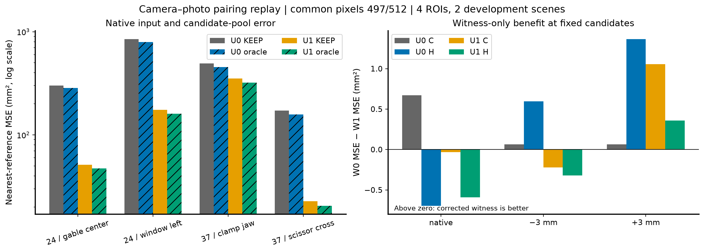
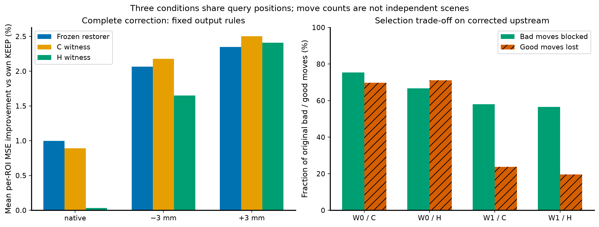

# 来源快照

原始路径：`/srv/slam-research/grf/map-denoise/runs/camera-pairing-replay-20260930T162130Z/REPORT.md`

# 相机—照片配对修复：先恢复几何输入，再结算选择能力

日期：2026-10-01。目标主机：liekkas。研究状态：M0–M3已执行完毕，旧实验保持只读。

## 1. 目标与核心结论

原目标是保留有效几何并修复错误几何。本轮检验：上一轮发现的照片/相机内参配对冲突，在修复后能否分别恢复初始几何、候选质量和照片筛选能力。

最重要的结果是上游恢复：在相同的497个有效查询像素上，未加扰动初始重建的四ROI平均MSE从453.456降到150.121 mm²，下降66.894%，四ROI全部改善。1mm以内点从35/497增至341/497。原先不能把上一轮坏结果直接归因于恢复器或留出照片，现已有实际干预证据支持这一更正。

第二项结果较小但有用：冻结恢复器在修正输入的三个条件上都有正的平均收益；完整修正后的C见证达到事前联合验收，H见证没有达到。修正W并不使每个条件下的绝对MSE都更小，因此不能将几何上游的大收益说成“新评分器提高了66.9%”。

## 2. 方法与不变项

场景：已曝光的scan24/scan37；四个照片定义ROI；native/−3/+3 mm。native仅指CPU照片重建未施加人工扰动，不等于已正确的几何，也不是旧成品网格。

| 因素 | 0 | 1 |
|---|---|---|
| U，上游 | 封存初始点、KEEP/A/B、225特征、模型选择 | 修正投影重新构造上述工件；模型和参数冻结 |
| W，见证投影 | 原world_mat配对 | 与实际照片关联的PINHOLE配对；reference与source同时更正 |

每个U内两W严格共用几何、候选、法向与模型选择；W只能保留恢复器动作或回退KEEP。Q构造、C特征/构造侧见证、H像素在候选封存后读取。C与候选并非独立；H也仅条件于已有相机的像素留出，不能宣称整个SfM上游独立。

M0保持旧毫米R/C，以照片关联K重组投影；COLMAP角点坐标先转数组中心，再执行PIL半分辨率resize。所有坐标转换来自来源和规范，不由激光GT拟合。26个视图、43项来源哈希、78个独立数学算例与7项映射测试通过；24对二维对应的中位极线残差全部降低。见[MAPPING_REPORT.md](MAPPING_REPORT.md)。

固定旧512个reference查询像素。合格旧query优先保留，再按旧hash补context至384；同一priority规则严格复现U0。U1在两个scan37 ROI分别强制纳入6、2个查询并替换等量非查询context。因此U是完整上游修复，包含深度范围和context支持变化，不是只改变一个内参数字的纯因果估计。旧法向未单独保存，按冻结函数重算，U0W0评分逐值复放验证一致。

| ROI | 固定查询 | U1合格查询 | U1 context |
|---|---:|---:|---:|
| scan24_window_left |128|120|155|
| scan24_gable_center |128|122|221|
| scan37_scissor_cross |128|128|384|
| scan37_clamp_jaw |128|127|384|
| 合计 |512|497|—|

15个失败均为原质量阈值不通过，没有用更容易的新点替补。主比较采用497共同有效像素；全有效集的另一套表也在RESULTS.json。三条件共有1491条配对观测，但仍只有497个基础位置、4ROI、2开发场景。

## 3. 结果

### 3.1 上游修复恢复了大量几何信息

以下为native同像素比较，MSE单位mm²，precision为与数据集参考点最近距离≤1mm。Oracle仅事后在已固定KEEP/A/B中逐点选择，并非可部署结果。

| ROI | U0 KEEP | U1 KEEP | U0 Oracle | U1 Oracle | U0/U1 1mm precision |
|---|---:|---:|---:|---:|---:|
| window_left |849.845|174.763|792.543|160.379|7.50% / 66.67%|
| gable_center |300.426|51.298|284.517|47.325|8.20% / 81.97%|
| scissor_cross |171.829|22.807|157.478|20.521|8.59% / 74.22%|
| clamp_jaw |491.724|351.617|454.055|320.633|3.94% / 51.97%|
| 四ROI等权均值 |453.456|150.121|422.148|137.214|7.06% / 68.71%|

四ROI的误差中位数从6.40–10.74mm降为0.35–0.89mm；但仍有较大离群误差，不能只用中位数宣布重建完成。

左图对数轴展示所有ROI，不挑例子；右图固定U后比较W0−W1的MSE，正值才代表修正见证更好。

### 3.2 冻结算法在修正输入上出现收益，但总体绝对增量较小

完整U1W1的绝对误差（四ROI等权MSE，mm²）：

| 输出 | native | −3mm | +3mm |
|---|---:|---:|---:|
| KEEP |150.121|154.980|149.314|
| 冻结恢复器 |149.606|153.797|148.757|
| C见证 |149.721|154.562|147.954|
| H见证 |150.208|154.291|148.469|
| 固定候选Oracle，仅诊断 |137.214|137.893|135.985|

按上述均值再求改善率，恢复器为+0.343%/+0.763%/+0.373%；C为+0.266%/+0.270%/+0.911%；H为−0.058%/+0.445%/+0.566%。这是对**修正后自身KEEP**的额外收益，不包含上游66.9%的变化。

事前沿用的扰动保留率指标采用“先每ROI算改善率，再等权平均”，数值不同：

| 输出 | native | −3mm | +3mm |
|---|---:|---:|---:|
| 冻结恢复器 |+0.998%|+2.065%|+2.349%|
| C见证 |+0.892%|+2.177%|+2.504%|
| H见证 |+0.033%|+1.651%|+2.409%|

两种聚合不可混用。H在native的平均逐ROI百分比略正，但绝对平均MSE恶化，按事前规则仍判不通过。C的native MSE不高于KEEP，扰动收益保留分别105.4%与106.6%，故通过本回放的联合指标。H的native不通过，−3mm保留率约80.0%，亦未到90%。这不是新的独立场景确认或每ROI不损伤保证。

U1W1恢复器在12个ROI×条件中9个改善；C与H各10个改善。C仍在window_left/−3mm与clamp_jaw/native恶化。

### 3.3 W纠正更愿意保留好修正，但也放过更多坏修正

在固定U1候选的1491条条件观测中，恢复器共移动779次：539有益、138有害、102中性。标准仍为最近参考距离改变超过0.1mm。

| 见证 | 保留有益移动 | 保留有害移动 | 丢掉有益移动 | 拦下有害移动 |
|---|---:|---:|---:|---:|
| W0 C |163|34|376/539|104/138|
| W1 C |411|58|128/539|80/138|
| W0 H |156|46|383/539|92/138|
| W1 H |433|60|106/539|78/138|

因此，修正投影恢复了大量原先被错杀的有效动作，但不是“更严格地拒绝所有坏动作”。按绝对MSE，固定U1的W1 C在native和−3mm比W0 C稍差，仅+3mm更好；H也相同方向。主指标与移动次数都必须保留。

## 4. 解释与下一步

本轮支持C1：成像输入契约存在可修复的实质问题，修正完整上游后KEEP和候选Oracle在四ROI都明显变好。C2是条件性的：W修正能提高有效修正保留量，但不保证每种条件下选择损失都降低。主要资产应是正确的相机接口和已经重新出现正收益的冻结恢复器；C见证保留为本回放通过的候选，不据此改部署默认。

事后误差分解发现，U1 native仍有83/497点距离参考超过5mm，其中75点的KEEP/A/B全部超过5mm。各ROI最差约5%的点贡献74.0%–95.0%的平方误差。故剩余主要绝对误差不可能仅靠当前三候选路由完全消除。该诊断在评分后形成，没有据此更改阈值或排除点。

下一项优先投入：冻结已核实成像接口、同512查询像素与照片分组，在全固定样本上比较当前CPU平面扫描与对口成熟MVS初始化；将大错点视为评分后的诊断分层，不用GT挑选算法输入。候选在这些位置变好后，再在未用于构造的照片上验证选择增量。暂不重训大预测器，不再用错误相机配对去评价新几何表示。

本轮为已曝光场景开发修复回放，未补独立场景、官方全DTU协议、完整相机生成历史或成熟MVS基线；没有把修复工程输入错误当成新去噪原理。既有更早实验是否使用同一错误配对需逐run审查，本轮不能追溯性宣称全部V1–V28结果无效。

## 5. 核验与复现

- 旧162项封存文件、新302项预测封存文件、6项评价协议锁均通过。24个上游case×2个W完整运行。
- 11项映射/resize/veto/权限测试通过；U0W0全部输出和见证分数严格复现。
- 独立Open3D读取＋sklearn最近邻复算96条记录、384项MSE和10,768数值字段，最大绝对差0；另20查询全参考暴力最近邻差0。
- 独立检查由已有代理完成，same-family/provisional。技能要求的全新语义审稿代理因线程配额未能创建，状态REVIEW_UNAVAILABLE，不伪报fresh PASS。
- 预测、评价规则先封存，随后打开数据集激光参考。实际指标是自定义采样查询到参考的最近邻误差；local coverage是native KEEP的1mm参考足迹，配对比较用两U对称并集，不是全场景完整性。
- 使用experiment-plan固定对照与分母，analyze-results分开原始量和百分比，goal-first-reporting组织结论；图按kdense-matplotlib模板生成，不用平滑曲线或选取赢家替代全部ROI。

主数据：[RESULTS.json](evaluation/RESULTS.json)、[CASE_METRICS.csv](evaluation/CASE_METRICS.csv)。
独立核验：[INDEPENDENT_NUMERIC_CHECK.json](evaluation/INDEPENDENT_NUMERIC_CHECK.json)。
候选支持与失效身份：[QUERY_MANIFEST.json](QUERY_MANIFEST.json)。
事后分解：[POSTHOC_TAIL_DIAGNOSIS.json](evaluation/POSTHOC_TAIL_DIAGNOSIS.json)。
复现命令：[COMMANDS.md](COMMANDS.md)。
