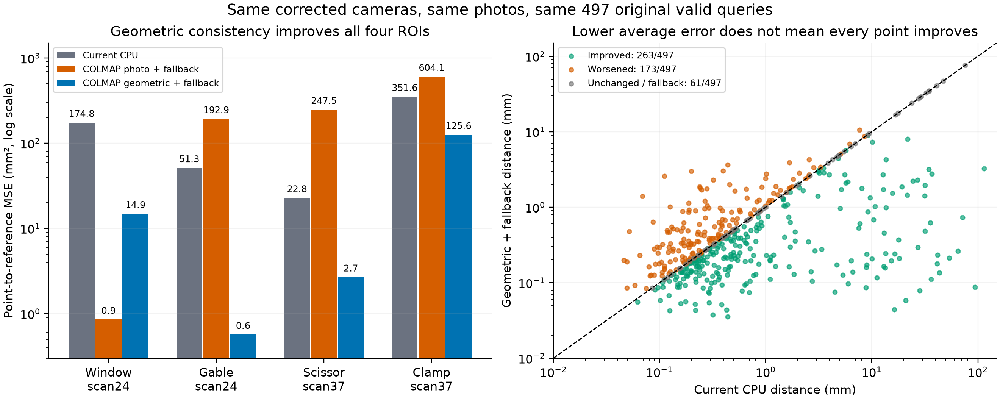

# 来源快照

原始路径：`/srv/slam-research/grf/map-denoise/runs/colmap-fixed-pixels-20260930T172250Z/REPORT.md`

# 成熟多视图几何一致性补出了现有候选缺失的修正

运行：colmap-fixed-pixels-20260930T172250Z；主机 liekkas；日期 2026-10-01。

## 1. 原始目标与本轮问题

原始目标仍是**保留有效几何，修复错误几何**。上轮修正相机接口后，输入误差明显下降，但旧 KEEP/A/B 候选在75个查询上全部偏离官方三维参照超过5mm。本轮检验：同照片、同相机、同查询下，成熟MVS能否补出这些位置所缺的几何。

结论：**能。官方COLMAP几何一致性输出在其中51/75个位置补出≤5mm候选；用“有有效MVS深度则采用，否则保留当前输入”的固定规则，原497个有效查询的四ROI等权MSE下降76.07%，四个ROI均下降。** 但还没有实现逐点无损替换。

## 2. 方法：只改变重建模块，不重新学习路由

- 两个既有开发场景scan24/37；4个照片定义ROI，各128固定像素，共512。512位置全部运行，没有只跑75个已知难点。
- 保留修复后的相机R/C、物理毫米单位；每场景只用reference 0022和4张Q照片（0016/0035/0017/0007），不加入C/H照片。
- 逐字节相同的777×581灰度图。官方 `pycolmap-cuda12==4.2.1`；GPU RTX3060Ti。固定相机输入，空points3D.txt，不载入历史SfM点。
- Photo：官方过滤后的photometric PatchMatch。Geo：5图各自未过滤photometric，再参考图geometric consistency与默认过滤；它同时包含深度一致性优化与过滤，**不能由本表单独分摊两者的收益**。
- 参考深度范围严格匹配旧法实际扫描端点：scan24 [559,786]mm，scan37 [581,865]mm；Q范围由reference视锥顶点转换取得，未用GT。
- 算法其它参数为官方默认；只固定设备与资源额度。库内CUDA随机初始化不暴露seed，额外scan24独立workspace重复结果相同，不冒称独立随机种子。
- 15个实际CUDA调用合计68.85秒。全部118项输出/配置封存后，才对新结果读取DTU官方structured-light三维参照并评分。没有训练新模型、没有修改部署默认。

### 相机约定不是照抄通用格式

查实4.2.1稠密内核以整数row/col及原样K回投，故预缩小图像的MVS-only workspace使用数组K主点(388,290)。通用SfM角点格式主点(388.5,290.5)不是该内核自动做过的转换。ADDENDUM_PRE_RUN在执行前锁定此适配，禁止库再次resize。未改官方算法。独立核查见review目录。

## 3. 主结果：同497查询的固定回退，不能删难点

以下都是原CPU有效的同497查询；MVS缺深度就保留对应旧点。MSE/MAE为四ROI等权均值，正确点和大错点为合并计数。正改善以CPU作为分母。

| 方法 | MSE mm²↓ | 相对CPU | MAE mm↓ | ≤1mm点数/497↑ | >5mm点数/497↓ |
|---|---:|---:|---:|---:|---:|
| 当前CPU平面扫描 | 150.1211 | — | 4.2321 | 341 | 83 |
| COLMAP光度＋缺失回退 | 261.3250 | 恶化74.08% | 3.1259 | 362 | 32 |
| **COLMAP几何一致性＋缺失回退** | **35.9203** | **改善76.07%** | **1.6484** | **379** | **25** |

光度臂的MAE与大错点数量改善，但MSE反而恶化：少量更极端的错误会主导平方损失。不能只看某一项较漂亮的统计。几何一致性臂同时改善主MSE、MAE与正确点数量。

| ROI（有效查询数） | CPU MSE | 光度＋回退 MSE | 几何一致性＋回退 MSE |
|---|---:|---:|---:|
| scan24 window（120） | 174.7625 | 0.8538 | 14.8789 |
| scan24 gable（122） | 51.2982 | 192.8653 | 0.5665 |
| scan37 scissor（128） | 22.8071 | 247.4894 | 2.6763 |
| scan37 clamp（127） | 351.6165 | 604.0915 | 125.5596 |

两场景各自等权MSE也下降：scan24 113.0304→7.7227；scan37 187.2118→64.1179。

### 覆盖单独报，不用低覆盖伪装高精度

- CPU在512查询中497有效。
- Photo在512中511有效；与CPU共同有效496。其共同有效MSE261.3907，对应同点CPU149.6859。
- Geo在512中450有效；与CPU共同有效436。其共同有效MSE2.35998，对应同点CPU137.3282。
- **不能把Geo条件MSE2.36直接与CPU497点的150.12相除当整体改善**。主结论使用回退后的同497点35.92。
- CPU缺失的15个位置中，Geo新覆盖14个，13个≤1mm。它们单独报告，没有加入原497点的增益分母。

### 哪些改善，哪些被改坏

Geo＋回退在497点上：263改善（52.92%），173恶化（34.81%），61不动/缺失回退（12.27%）。

原来341个≤1mm点中，有23个移出1mm范围；同时61个原来>1mm点进入范围，净增加38个正确点。clamp的≤1mm数量甚至66→64，虽该ROI的MSE仍下降。因此目前能力是**净改善且修复严重错点**，不是“每处有效几何都保留”。

## 4. 候选补齐：旧上界并非问题本身的上界

旧池最优仍>5mm的75个位置是封存后诊断子集，不参与构造或过滤参数选择。

| 新候选 | 75难点中有输出 | 新候选≤5mm | 新候选≤1mm |
|---|---:|---:|---:|
| Photo | 74 | 57 | 36 |
| Geo | 59 | 51 | 34 |

旧 KEEP/A/B oracle 的四ROI等权MSE是137.2144；加入已封存Photo与Geo后是6.1561（降低95.51%），残留旧难点从75降到15。该表使用GT挑选，仅说明候选池的可达能力，**不是可部署成绩**。未过滤photometric预pass仅作附录诊断，不加入主enriched-pool oracle。

## 5. 解释与研究决定

1. 上轮的“缺好候选”不是抽象空间不够高级，也不意味着必须继续增大预测器。本轮成熟MVS实际给出了原池没有的正确几何。
2. 仅扩大光度候选不够：直接采用Photo仍有极端错配。默认多视图深度一致性阶段给出了有用的选择/约束，虽然本轮尚未隔离优化与过滤各自贡献。
3. 需要保留成熟基线作为下限。后续若构造自己的修订器，应证明在它之上减少误改、补齐缺失或提高跨场景表现，不能继续只赢旧CPU输入。
4. 本轮尚有明确余量：61处Geo缺失回退；75旧难点中24处Geo未救回；23处原正确点被改坏。这些交集并非三个可相加的错误分摊。

**下一步首选：冻结“官方Geo＋原输入回退”作为比较基线，在未参与开发的新场景检验原始输入净收益。** 自研增量若继续，应只针对“保留原本正确点且补齐Geo缺失”，与该简单基线正面对照，不再把旧CPU当唯一竞争者。

本轮不声称新算法、完整DTU榜单、跨场景泛化或薄层物理身份恢复；评价是官方三维点参照上的固定像素开发实验。未引入新独立场景，未改默认部署。

## 6. 核验、复现与工件

- `RUN_LOCK.json`：源文件、相机、灰图、配置、算法及评价脚本的冻结哈希。
- `PREDICTIONS_SEALED.json`：118项封存；`job_records/`包含真实运行耗时。
- `evaluation/RESULTS.json`：主表、覆盖、难点计数及重复验证。
- `evaluation/ROI_METRICS_SCOPED.csv`：审查后明确区分method全覆盖和scope覆盖。旧`ROI_METRICS.csv`保留；旧共同有效行的辅助coverage字段原用全方法支持，已在新表修正字段语义，MSE和预测未改。
- `evaluation/POINT_METRICS.csv`：逐查询、逐方法误差，含缺失。
- `review/`：接口、代码、独立数值与fresh审计。具体完成状态以各核验文件为准，不用主作者自评替代。
- 新一轮RUN_LOCK没有直接绑定导入的旧评价器及GT来源JSON；现已独立核对其原始封存/哈希并将当前版本补记为**运行后**依赖记录，不追称本轮运行前已全部锁定。Fresh审计为same-family、provisional、WARN；未发现主结果数值不符。这不影响已复算数字，但下一轮应在启动前将评价依赖闭包一并锁定。
- 图：`figures/mvs_comparison.png/pdf`、`figures/fixed_pixel_errors.png/pdf`。
- 命令：`COMMANDS.md`。旧运行目录未修改。

## 来源与过程说明

- 官方实现：[pycolmap](https://colmap.github.io/pycolmap/index.html)、[4.2.1 CUDA wheel](https://pypi.org/project/pycolmap-cuda12/4.2.1/)、[已知相机的dense-only流程](https://colmap.github.io/faq.html#reconstruct-sparse-dense-model-from-known-camera-poses)。
- 原始MVS方法：Schönberger et al., Pixelwise View Selection for Unstructured Multi-View Stereo, ECCV 2016；本轮实际运行的是COLMAP4.2.1实现，不把当前版本的全部行为归入原论文。
- 实验规划skill使照片/查询/缺失分母与运行前通过条件固定；汇报skill按目标—方法—结果组织。Matplotlib skill用于同轴/同色标和PNG/PDF输出，图表不是生成式示意图。
- 作图流程参考：Kassis, T., Agarwal, V., He, Y., Patel, D., & Brueckner, A. M. (2026). [Scientific Agent Skills: A Library of Procedural Knowledge for Research Agents](https://arxiv.org/abs/2609.00065)，核对到v2；其程序性建议不是本实验有效性的外部证据。
