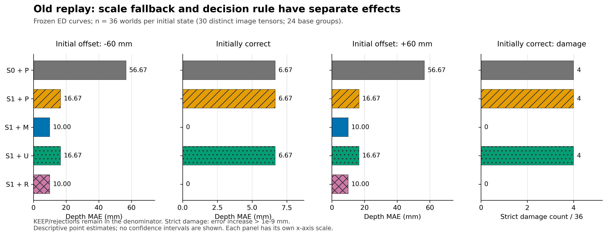
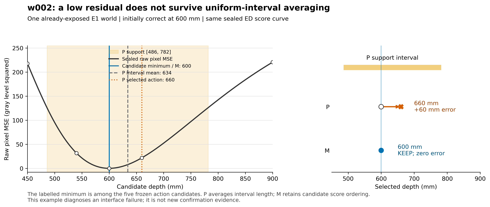
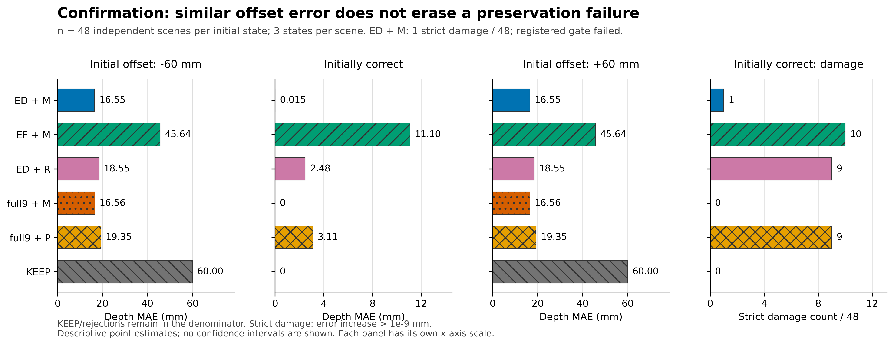

# 决策接口实验：2026-10-08 发布与核验

本次把已经完成的B0/B1/B2/B3实验提交到既有GitHub仓库，不增加实验，不修改部署默认，不重建GitBook网页。

## 当前结论

目标是保留有效几何并修复错误。补齐独立尺度回退、避免把评分曲线压成均匀区间后，旧回放每个偏移方向改善从2/36增至30/36，正确输入损伤4/36降到0/36。

规则冻结后的48个新合成场景中，每个±60mm偏移方向均有36改善、12同色无信息KEEP、0恶化。整体MAE从60降至16.5462926mm（降低72.42%）。正确输入47/48保留，另1例误移0.731723mm，故注册的严格零损伤科学门槛为FAIL。

同规则full9+M的偏移MAE为16.5588143mm、正确输入0损伤；ED相对它的微小增益区间包含0。动态归属优于固定归属，但没有建立超出full9的系统增量。复杂风险R误伤9/48，比简单最小损失规则差。只支持当前合成族内结论，不是新的真实场景或跨设备验证。

## 可浏览入口

- [完整报告](../research_snapshots/2026-10-08/decision-interface-20261008T052305Z/REPORT.md)
- [预先冻结方案](../planning/decision-interface-20261008/refine-logs/EXPERIMENT_PLAN.md)与[实际执行表](../research_snapshots/2026-10-08/decision-interface-20261008T052305Z/refine-logs/EXPERIMENT_TRACKER.md)
- [逐项确认记录](../research_snapshots/2026-10-08/decision-interface-20261008T052305Z/confirmation/evaluation/ROWS.json)、[分组汇总CSV](../research_snapshots/2026-10-08/decision-interface-20261008T052305Z/confirmation/evaluation/RESULTS.csv)、[确认门槛](../research_snapshots/2026-10-08/decision-interface-20261008T052305Z/confirmation/evaluation/GATE.json)、[配对区间](../research_snapshots/2026-10-08/decision-interface-20261008T052305Z/confirmation/evaluation/PAIRED_BOOTSTRAP.json)
- [正式语义审计](../research_snapshots/2026-10-08/decision-interface-20261008T052305Z/EXPERIMENT_AUDIT.md)与[78项原现场复核](../research_snapshots/2026-10-08/decision-interface-20261008T052305Z/audit/FINAL_RECHECK_CORRECTED.json)
- [图注](../research_snapshots/2026-10-08/decision-interface-20261008T052305Z/figures/README.md)、[图表来源与哈希](../research_snapshots/2026-10-08/decision-interface-20261008T052305Z/figures/PROVENANCE.json)

### 旧回放：把评分信号转成动作



### 已有正确评分怎样被区间均值丢失



### 独立合成确认：恢复偏移仍不等于零损伤



## 发布范围与保持原件

来源主机liekkas；精确来源为 `/srv/slam-research/grf/map-denoise/runs/decision-interface-20261008T052305Z`。

914个文件、35,422,152字节，其中816个合成NPZ，包括标定/确认输入、真值、辅助量与评分曲线。源码、测试、协议、所有正负结果、日志失败、更正、审计、图与完整CSV均保留。逐文件来源、大小、SHA-256见[发布manifest](DECISION_INTERFACE_20261008_MANIFEST.json)。

只把历史AGENTS.md改名为SOURCE_AGENTS.md，字节不改，避免归档激活过期任务。排除10个私有 `.aris` 审阅轨迹/事件文件，正式审计保留；公开审计中指向私有轨迹的链接不在发布范围。未上传凭据、环境、原始真实数据或无关AgentRx附件。

原报告中的“未推送GitHub”描述实验结束时状态，本说明登记之后的发布，不回改原报告。原报告的图片使用本机绝对路径，在GitHub不渲染；上方图库提供可浏览的相对链接，保留原件哈希。

字节保留也包括原CSV的CRLF、SVG格式和文档尾部空行；Git空白格式提示不据此改写封存原件。新发布说明和核验脚本另行检查格式。

## 核验和可复现边界

从任意克隆目录，用Python标准库执行：

```bash
python publication/verify_decision_interface_20261008.py
```

该发布核验器只读取仓库内的manifest、数据和结果，不读取 `/srv` 源目录，不导入或运行原预测器。它核对归档集合、字节哈希、预测与评价对应、深度误差、汇总和科学门槛；核验PASS表示封存证据一致，不会把确认FAIL改写为科学成功。

完整历史实验重跑与结果核验不同：原runner、seals、tasks等保留绝对路径；其baseline还依赖相邻的混合像素及表面支持模块。三个依赖快照和冻结计划已在本仓库，但完整重跑仍需NumPy/SciPy与路径适配，作图另需Matplotlib。没有声称这是Windows一键运行包，也没有在归档目录重跑覆盖数据。

本轮原现场46测试、78复核通过；全新同系列语义审计WARN/provisional。两个evaluate进程完整封存后，在最后终端JSON输出遇到NumPy布尔序列化错误，原非零退出与后续完整工件收据均保留。不要删除故障证据或修改冻结算法来使状态看起来通过。

下一项仍是分离唯一小误移附近的外观、轮廓与积分误差，明确可分辨尺度后再做新确认；不再增加风险模型复杂度。
