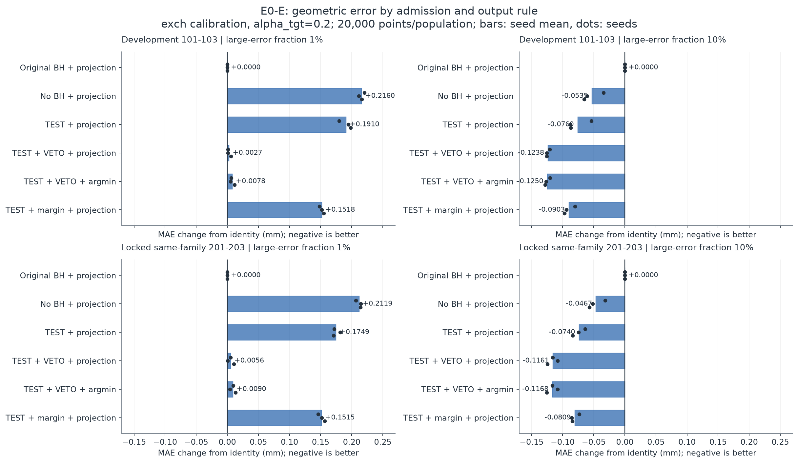
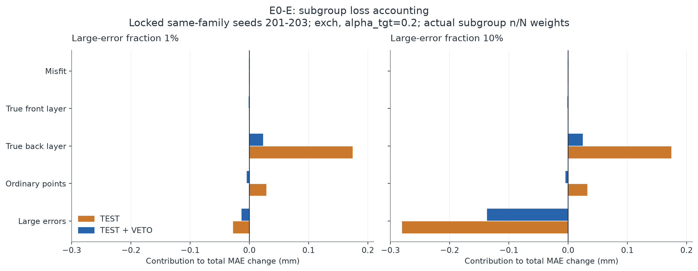
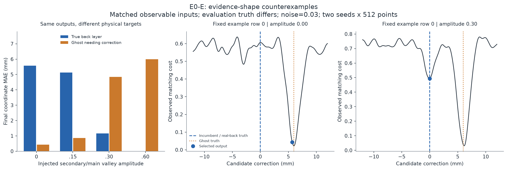

# E0-E：次级谷否决的条件收益与修复代价

日期：2026-09-16（Asia/Shanghai）。主机：liekkas。
证据位置：本目录 `results/`。实验协议、算子和参数在输出生成前冻结。

## 结论

本轮已实际实现并运行“单点检验 + 次级谷否决 + 连续边界投影”，不是仅做
计划或重算旧摘要。它在已测试的48个配置中，坐标MAE全部优于不带否决的
单点检验投影；相对identity则26/48改善，不能把配置数当独立场景数。

主要的exch、alpha_tgt=.2条件下，大误差比例10%时，开发均值由identity
0.644253降到0.520467 mm，同族锁定新种子由0.647297降到0.531203 mm。
大误差比例1%时，分别从0.206580变为0.209311、从0.207212变为0.212787 mm，
仍略差于不处理。这个对照把以往大幅净损伤压到了接近零，但未消除净损伤。

代价已定位：约86%–88%的背层正损伤被削减，但仅保留约47%–50%的原TEST
候选big有效改善。新规则没有通过事前规定的真实验证继续门槛，默认仍为
identity。保留原型及其条件性收益，不部署、不宣布已识别真实双层。

## 1. 实际构造及信息边界

核心算子是 `selective_operator.choose_outputs`。只接收代价曲线、候选网格、
对比度层、校准对象和从校准曲线估计的粗糙度；目标真值、子集和mm标志不进入
选择器接口。校准真值只用于声明的校准步骤。其输入校验和标签干预测试不是
操作系统安全沙箱，也不构成通用信息隔离证明。

旧原始CPR-2采用BH。本轮原BH链仍保留；`TEST`明确改成p<=.1的单点准入，
不能沿用BH的FDR声称。alpha_tgt控制目标集合，alpha_test控制单点检验。
连续边界投影直接复用E0-D；不改变原证据和几何输出方向。

VETO从完整代价曲线寻找有足够prominence、且与主谷充分分离的次级谷；
没有仅按alpha_tgt子水平集的连通数判断多峰。主谷宽度与校准粗糙度均来自
可观测曲线，不使用生成器真宽度或真噪声。阈值固定rho=.25，噪声项为
3*sigma_HF，分离距离为2*w_hat。sigma_HF只是高频残差粗糙度估计，不是
相关噪声标准差的已验证估计。具体公式与回退见PROTOCOL.md。

否决回退为KEEP，同时标记ACQUIRE；本轮没有执行采集，不能计信息或策略收益。
简单margin对照是自行实现的代价差置信度规则，不是官方外部软件复现，也不是
对传统置信度全部合理设置的穷尽搜索。

## 2. 覆盖范围

| 项目 | 实际执行 |
|---|---|
| 开发总体 | 101/102/103 × f_big=.01/.10，共6个，每个20000点 |
| 锁定同族复测 | 201/202/203 × 两种f_big，共6个，每个20000点 |
| 每总体配置 | exch/sfm × alpha_tgt=.2/.5，校准2000点 |
| 主对照 | 48配置 × 9方法 = 432输出方法块 |
| 配对证据压力测试 | 4种弱谷振幅 × 2种噪声 × 2种子 = 16套观测，分别评价两世界 |
| 点云文件 | 576个方法输出PLY + 48个评价参考PLY = 624个 |
| 单元测试 | 15/15通过 |
| 主实验墙钟 | 58.51秒，不含开发、最终重算及绘图 |
| 主进程峰值RSS | 659160 KiB；不是GPU或整个开发过程峰值 |

新种子是同一生成族的复测，不是独立真实场景。exch校准使用生成设定下的混合
比例，sfm是合成代理校准，不是本轮真实COLMAP点。不同参数配置复用总体。

## 3. 主结果：准入、终点与否决分开

下面仅列协议主条件exch、alpha_tgt=.2，单位mm；三个种子平均。完整sfm和
alpha_tgt=.5结果在RESULTS.json和METRICS.csv，未以主表筛掉。

| 方法 | 开发1% | 开发10% | 同族复测1% | 同族复测10% |
|---|---:|---:|---:|---:|
| identity | 0.206580 | 0.644253 | 0.207212 | 0.647297 |
| 原BH + 连续投影 | 0.206580 | 0.644253 | 0.207212 | 0.647297 |
| no-BH + 连续投影 | 0.422540 | 0.590795 | 0.419155 | 0.600591 |
| TEST + 连续投影 | 0.397548 | 0.568227 | 0.382070 | 0.573334 |
| TEST + VETO + 连续投影 | 0.209311 | 0.520467 | 0.212787 | 0.531203 |
| TEST + VETO + ARGMIN | 0.214368 | 0.519225 | 0.216231 | 0.530536 |
| TEST + margin + 连续投影 | 0.358428 | 0.553905 | 0.358689 | 0.566418 |

原BH在这四个汇总组均不移动。单点准入本身有增量，但不足以消除低错误比例下
的损伤。次级谷否决比当前固定margin对照更有效，仍不是无条件安全。

投影对ARGMIN没有全指标支配：加入相同TEST/VETO后，1%条件投影MAE较低，
10%条件ARGMIN略低；投影有害移动率更低。例如同族10%下二者MAE分别
0.531203与0.530536 mm，有害点占全部点分别0.6817%与1.3783%。差异未作
独立显著性或等效性判定，不因微小均值差取消投影，也不把投影称全面获胜。

## 4. 修复收益去了哪里

同族新种子、exch、alpha_tgt=.2，按实际子集点数/N加权。负号是改善，
下表每列各子集之和等于该方法的总MAE变化；不是按名义比例估算。

| 子集贡献 | TEST 1% | TEST+VETO 1% | TEST 10% | TEST+VETO 10% |
|---|---:|---:|---:|---:|
| big | -0.027052 | -0.012719 | -0.279965 | -0.136052 |
| base | +0.028243 | -0.004009 | +0.031904 | -0.003846 |
| twosheet_back | +0.173482 | +0.022575 | +0.173784 | +0.024129 |
| twosheet_front | +0.000185 | -0.000273 | +0.000314 | -0.000325 |
| misfit | 0 | 0 | 0 | 0 |
| 总变化 | +0.174858 | +0.005574 | -0.073963 | -0.116094 |

剩余背层损伤对总误差的贡献约0.023–0.024 mm：在1%条件里，它超过保留下的
big修复和普通点改善；在10%条件里，big修复足以抵消它。这解释了本测试中
总体比例改变时净收益符号为何变化，但不证明检验功率完全无关。

| 选择性代价（主条件） | 开发1% | 开发10% | 同族1% | 同族10% |
|---|---:|---:|---:|---:|
| 背层正损伤 / no-BH连续投影背层正损伤 | 12.06% | 12.91% | 12.78% | 13.63% |
| 保留big有效改善 / TEST原big有效改善 | 47.69% | 50.25% | 46.65% | 48.31% |

误拦并非仅集中在原生成器标记的多峰点。同族10%条件的big且原mm=false中：
低/中/高对比度层的候选数为125/1536/1610，否决124/1347/136个，
对应有效改善损失约99.29%/87.89%/8.86%。这是已有输出上的事后分层诊断，
不是事前预测，也没有据此重调规则。“原mm=false”不等于带噪曲线没有局部谷。
当前结果支持中低对比度候选受到大量误拦；尚未分别归因到宽度估计、粗糙度估计
或prominence阈值，不把其中一个自动认定为唯一原因。

在同族10%条件，TEST到TEST+VETO使背层翻层代理计数从1922降到264（分母
3000个背层点，来自三次复用总体）；但1mm点集召回从0.94233降到0.93710。
因此，正损伤降低不自动保证完整性改善。全部方法的点集指标均留档。

## 5. 反例检验：次级谷不是物理身份

这里故意保持完整可观测输入相同，只改变评价目标：真背层需保留0，重影需
修正到6mm。每套观测重复调用算子，所有输出逐元素相同。以下是噪声=.03、
种子501/502各512点的均值；振幅比指生成的次谷/主谷，不是方法读到的真参数。

| 弱谷振幅比 | VETO比例 | 真背层最终MAE | 重影最终MAE |
|---|---:|---:|---:|
| 0 | 0.10% | 5.5761 | 0.4240 |
| 0.15 | 8.01% | 5.1345 | 0.8655 |
| 0.30 | 79.49% | 1.1559 | 4.8441 |
| 0.60 | 100% | 0 | 6 |

无噪声时，0/.15不否决，.30/.60全部否决，符合阈值构造。完全遮挡真背层
没有自身谷时，规则可以大幅误移；重影获得伪匹配次谷时，规则可以拒绝必要修复。

这些是指定曲线接口下的逻辑压力测试，不是声称已经渲染出物理一致的双世界。
它们反驳的是“只要有次级谷就可普遍判定真实双层”的保证，而不是抹去主矩阵的
条件收益。真实物体上的发生频率和可区分性仍未测量。

## 6. 预测与继续门槛

同行提出的0.15mm净改善预测，在10%/exch/.2下未达到：开发改善0.123786，
同族改善0.116094 mm。1%不恶化超过0.03mm的宽预测通过；更严格的两种
错误比例均不劣于identity没有通过。不能将“符合宽容差”写成“已经更好”。

背层剩余损伤应<=no-BH的10%、big有效改善保留>=80%两条也均未通过。
准入预测与移动率需分开：base单点拒绝率、绝对分数过滤、目标集合过滤、
否决后移动率不是同一个量。它们保存于逐例observation字段与NPZ。

决定：保留原型，冻结结果，默认identity；不自动进入E1真实修订，不运行E2
采集调度或E3元载体。不是因为方法毫无效果，而是当前效果以较大修复损失为代价，
且反例显示它没有补齐表面身份信息。

若继续，下一项应优先检查真实逐视图证据是否支持“自身谷”的归属，或解释
中低对比度有效候选被误拦的具体原因。需要另定实验，不在这批结果上连续调阈值
直到门槛通过。一个多峰标签本身不新增观测信息。

## 7. 可复现性与证据口径

- 15项测试全部通过；包括强/弱次谷、平坦曲线、连续投影、KEEP+ACQUIRE、
  目标标签干预、损伤与净误差区别、子集账目守恒。
- 开发24配置的eligible/BH mask与E0-D完全一致，no-BH连续投影与已保存
  数组逐元素相等；原算法的比较链没有被替换。
- 从NPZ独立公式重算432个方法坐标块、432个点集合块与288个配对世界
  方法MAE，最大数值差为0。该核验是本机保存结果重算，不是独立实验室复现。
- 主矩阵所有方法PLY与对应输出转float32逐元素一致；相对float64坐标
  的最大量化差为0.00000610352 mm。不能把浮点文件宣称为无限精度。
- 391个旧实验、构造和报告文件的哈希未变，锁定实施源未变。
- 无GPU使用、依赖安装、GitHub提交、真实数据下载或后台留跑。

复现命令见COMMANDS.md。`run_experiment.py`拒绝覆盖已有results目录。
本轮没有宣称FDR、校准后的条件损伤保证、真实场景净收益或方法新颖性已建立。

## 8. 对整体工程的贡献

E0-D证明了连续边界修复和模块分账的必要性；E0-E进一步给出一个实际可运行
的选择性修订器，并量出其收益/误拦取舍。它补上了“单点准入+连续投影+证据
否决究竟怎样”的缺失比较，不能再仅用no-BH模块结果替代它。

新贡献目前是条件性应用原型与机制证据，不是通用薄结构识别。对元研究，只能
借鉴“否定现任不等于新解释正确”的诊断结构；本轮没有测量科研策略效率。
看次优匹配、代价差或曲线歧义已有文献基础，本地margin臂也不覆盖所有先前方法。

相关背景：Hu与Mordohai，A Quantitative Evaluation of Confidence Measures
for Stereo Vision，TPAMI 2012：
https://mordohai.github.io/public/Hu_EvalutionOfConfidence_PAMI12fin.pdf
本轮未重新作系统新颖性检索。
