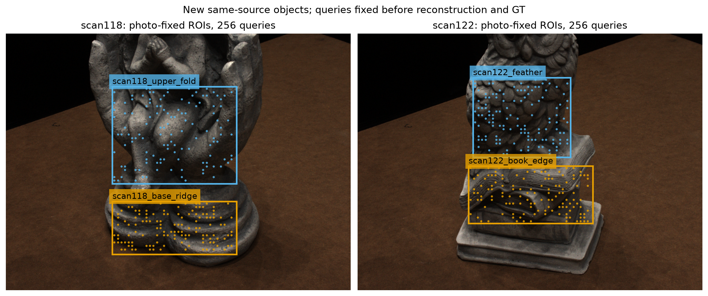
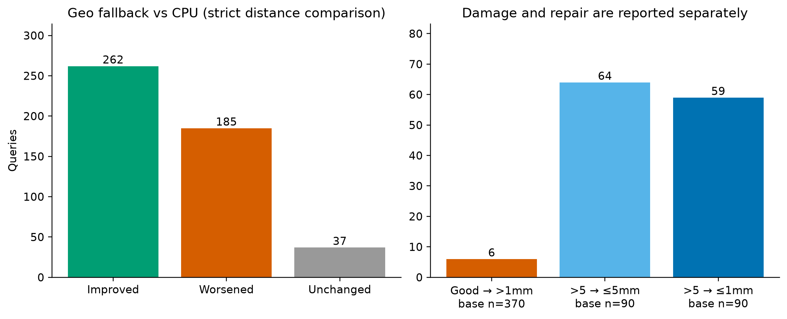

# 冻结规则迁移：两个新物体上保留了几何一致性的修复收益

日期：2026-10-01（北京时间）。运行：`colmap-transfer-20260930T180000Z`，主机 `liekkas`。

## 1. 原始目标与这轮改变

目标是**保留有效几何、修复错误几何**。本轮没有再造评分器，而是把上一轮已固定的“官方 COLMAP 几何一致性＋无效处旧点回退”迁移到两件新物体，检验其是否只对旧场景有效。

scan118、scan122 是上一批确认实验预先保留而未运行的候补；限定本机4209份历史实验文本检索没有发现既往运行记录。它们是**同 DTU 采集来源中的新物体**，不是跨传感器验证。各选两块照片定义的局部区域，重建前锁定512个请求像素；CPU得到484个有效点，所有主结果使用这同一484点总体、四ROI等权（也等价于两场景等权）。

这里的“输入”是本轮从五张照片重建的 CPU plane-sweep 初值，**不是此前高质量 GeoSVR 成品网格**。不能把本表的改善与旧网格上不足1mm的误差直接拼接，或称已证明成品网格原生去噪成功。

## 2. 本轮方法

固定五视图、半分辨率灰度、给定相机、CPU搜索/阈值和COLMAP默认PatchMatch参数。参考图为0022，源图为0016/0035/0017/0007。复用更正后的像素—相机对应：raw PINHOLE K缩小一半后主点减0.5，COLMAP dense整数像素射线与CPU采样一致。没有利用参照重新估计相机或对齐点云。

三个系统：CPU初值；COLMAP纯光度＋旧点回退；COLMAP几何一致性＋旧点回退。后两者有效时替换旧点，无效时保留旧点；没有GT选择器、Oracle或新学习器。所有预测封存后才从官方`Points.zip`获取三维参照。14个GPU作业实际累计63.29秒；CPU固定查询重建约1.36秒（不含输入准备、下载和审核），二者工作量不同，不能当公平速度排名。

**搜索域并非相同的硬边界。** 两者传入相同的逐场景深度区间，但CPU严格在区间内搜索，官方COLMAP 4.2.1的扰动/平面传播不对最终深度施加相同硬截断。独立审计发现466个geo有效输出中59个在该区间之外，其中50个属于主表484点。它们贡献75.03650mm²的等权MSE下降，占总下降96.18449mm²约78.0%。这不是事后剔点，也没有改写主指标；它限定了归因：本轮比较整套系统，不能把收益全解释成共同有界搜索域内的几何一致性增量。详见`review/DEPTH_RANGE_SUPPORT_CHECK.json`。

## 3. 实测结果

点到官方DTU三维参照最近距离；MSE单位mm²，MAE单位mm。百分比=(CPU MSE−输出MSE)/CPU MSE，正值改善。

| 系统 | 四ROI等权MSE | 四ROI等权MAE | 相对CPU MSE | ≤1mm点数/484 | >5mm点数/484 |
|---|---:|---:|---:|---:|---:|
| CPU初始重建 | 168.98746 | 4.94754 | — | 370 | 90 |
| 纯光度＋回退 | 247.71447 | 2.43620 | −46.59% | 436 | 19 |
| 几何一致性＋回退 | **72.80297** | **1.99997** | **+56.92%** | **441** | 26 |

| 新场景 | CPU MSE | 几何一致性＋回退 MSE | 改善 |
|---|---:|---:|---:|
| scan118 | 250.98142 | 100.57715 | 59.93% |
| scan122 | 86.99350 | 45.02878 | 48.24% |

两个场景、四个ROI的MSE均改善，满足本轮预定“两个场景均改善”的有限迁移条件。区域收益并不均匀：upper_fold仅由141.056降至134.781，而base_ridge由360.907降至66.373。

### 修好了多少，又伤害了多少？

几何一致性＋回退相对CPU：262/484点距离变小（54.13%），185/484变大（38.22%），37/484保持（7.64%，本轮均因MVS无效回退）。这是严格距离变化计数，很多变化仍在1mm内，不等于185个点都成为严重错误。

原本370个≤1mm正确点中，6个被移至>1mm（1.62%）；原本90个>5mm严重错点中，64个被修到≤5mm，其中59个到≤1mm。≤1mm点净增71个。对CPU缺失的28个请求，geo另产生19个新点，其中15个≤1mm；这19个**没有混入**主表484点分母。

剩余26个>5mm错误全部位于37个CPU回退位置；这37点贡献输出72.80297mm²中72.66090mm²（99.80%）。有效geo输出在本轮查询上没有>5mm错误，但仍有上述6个原正确点越过1mm。这把后续瓶颈具体化为“缺少可靠新深度时，保留了旧错误”，而不是大量已接受geo点仍严重错误。

## 4. 为什么这个结果重要

**可继承的能力已从旧场景回放推进到新物体确认。** 相机配对修复之后，成熟MVS的几何一致性与简单回退，在不重新训练/调阈值的情况下保留了大幅修复收益。它应作为下一阶段必须面对的强基线，而不是把早期CPU初值当作唯一对手。

**光度匹配改善多数点，不保证控制最坏错误。** 纯光度MAE降低、1mm内点增多，却因少量长尾错误让MSE恶化46.59%；其中两个点贡献其MSE的74.25%。几何一致性系统MSE更低但>5mm个数比纯光度多，说明“坏点多少”和“坏点有多坏”是两件事。搜索域、跨视图优化、过滤和回退均可能参与收益；本轮没有把这些因素的因果贡献分离出来。

**收益不是新算法创新性的证明。** 主体来自官方COLMAP，贡献是成像接口更正、同信息固定像素对照、冻结迁移及完整损伤账。此前自研候选/学习选择器尚未在这两个场景上与该强基线比较。

## 5. 范围、复核与下一步

- 两个同来源物体、四个手工照片ROI；ROI可包含边界和背景，没有使用GT/前景遮罩筛点。没有声称整个物体表面或薄层身份安全。
- 官方DTU structured-light三维点样本是独立评价参照，不是从当前输出生成。指标为单向最近邻局部准确度，未运行官方完整DTU观察掩码/完整性排行榜。
- 给定相机与归一化元数据的上游生成过程未独立重建；本次核对的是实际配对、物理单位及运算一致性。
- 无GPU随机种子新重复；冻结的是官方4.2.1及相同默认选项，上轮重复结果不可冒充本轮重复验证。
- 独立核验145份绑定文件与官方参照CRC/大小/SHA；对1457个原始有效CPU/photo/geo点逐个遍历全部官方参照点，重算全部2560行保存指标，距离最大差0.0mm。详见`review/INTEGRITY_FINAL.md`与`review/INDEPENDENT_NUMERIC_CHECK.json`。确定性数值复算通过；语义审计为同模型家族、暂定，并非跨家族确认。

下一步应固定这套成熟基线，先针对**26个回退严重错点的候选缺失**检验更充分的深度搜索/视图支持，并同时看6个原正确点损伤。若做机制消融，需先对齐实际搜索域，避免把扩大搜索的收益归到选择器或一致性项。不要仅为了超过当前表格重调这两件已揭盲物体。本轮不改变部署默认，不开启新调参竞赛。

## 文件与方法来源

协议：`refine-logs/EXPERIMENT_PLAN_20260930_180000.md`；输入身份与历史曝光：`SCENE_SELECTION.json`、`INPUT_MANIFEST.json`；锁：`RUN_LOCK.json`、`MVS_LOCK.json`、`PREDICTIONS_SEALED.json`；原始指标：`evaluation/ROI_METRICS.csv`、`POINT_METRICS.csv`、`TAIL_METRICS.csv`、`RESULTS.json`；复现命令：`COMMANDS.md`。

- 官方COLMAP：<https://colmap.github.io/pycolmap/index.html>；固定发行`pycolmap-cuda12==4.2.1`。
- 官方参照：<https://roboimagedata2.compute.dtu.dk/data/MVS/Points.zip>；两个成员CRC、大小和下载后SHA记录于`references/MANIFEST.json`。
- 作图采用`kdense-matplotlib`的OO/同分母/明确坐标规范：Kassis, T., Agarwal, V., He, Y., Patel, D., & Brueckner, A. M. (2026). *Scientific Agent Skills: A Library of Procedural Knowledge for Research Agents*. <https://doi.org/10.48550/arXiv.2609.00065>。这是软件使用说明，不是本实验科学结果的依据。
