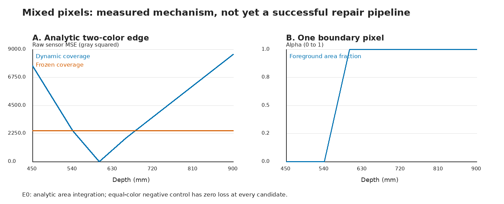
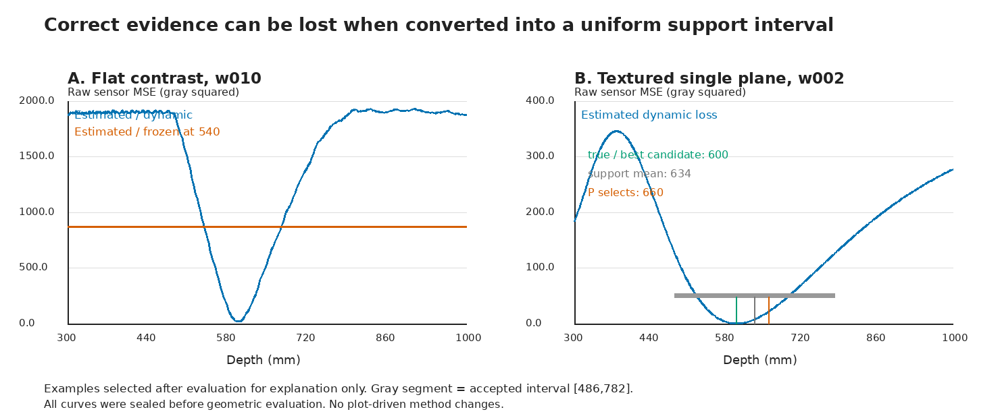

# 混合像素实验：候选证据成立，当前决策接口丢失了收益

2026-10-08；liekkas；E0 + E1 开发实验。目标仍是**保留有效几何、修复不足**。

## 1. 这轮回答了什么

我们检验：不再删除边界混合像素，而让前后两张面共同解释它，能否增加正确深度的证据。

实测答案分两层：**这套受控装置中，图像估计的动态混合模型保留了有效的深度排序信息；但“残差转支持集 + 原有P决策”没有把它转成更好的修复。** 新端到端方法未通过 full9，不升级，不进入E2确认。

普通动态模型ED仅从照片估计辅助量，在30个有信息的图像世界里均把真实候选排第一；6个全图同色世界没有虚假区分。这里30个有信息世界含宽度重复，实际27个不同观测张量，不能称30次独立验证。真实候选在设计中固定为600 mm，这不是跨深度或真实场景结果。

## 2. 方法与比较边界

- 参考图及一个训练源图估计前后景外观、轮廓和背景；预测另一个源图。交换源图做第二折。两折不是独立样本。
- 四个混合模型臂共享预测器、冻结外观容量、候选、每折182个整数传感器像素和分母。ED/OD改变每条子射线的归属，EF/OF把归属冻结在现任，但仍改变纹理投影。
- E是图像估计；O是显式提供真实参考外观、轮廓与背景的诊断，不提供目标深度。O不是部署方法，也不是整体最优Oracle。
- K不处理；N为原full9 + P。N使用相同三张图、相机及候选，但使用81点warp/NCC，并非和四个混合臂相同的像素测度。N比较属于系统比较；动态/固定比较才隔离覆盖变化。
- P保持原样：把接受深度合成区间，按区间长度求均值，选最近已有候选，预计正收益才移动。新残差桥接使用训练留块尺度，绝对门槛9、超额门槛4。这是工程准入，不是置信保证。

E1：24个设计组（四机制×两宽度×三种子），另加12次只改变背景的配对，共36个图像世界。三个初态540/600/660，真深度600；六臂共648条唯一决策。只有30个不同观测张量：单平面与同色负控的两种宽度不改变图像，各有3对重复。没有用这些重复计算置信区间。新前景为高16像素的斜矩形，不是历史方形装置的逐例重复。

## 3. 主要终点：full9仍然更好

深度MAE，单位mm，越低越好；每格36个图像世界，拒绝不从分母剔除。

| 输入状态 | 不处理K | full9 + P | 图像动态混合ED + P |
|---|---:|---:|---:|
| −60 mm偏移 | 60.00 | **10.00** | 56.67 |
| 正确输入 | 0.00 | **0.00** | 6.67 |
| +60 mm偏移 | 60.00 | **10.00** | 56.67 |

ED每个偏移方向修好2/36（5.6%），34/36误差未减；full9修好30/36（83.3%）。在正确输入，ED伤害4/36（11.1%），每条移到660；这四条实际上来自两个不同单平面图像的宽度重复。另32/36保持原位。两个偏移方向没有误差进一步增大，但−60中有4条从540移到660，误差大小相同，不能把“误差没变”写成“点没移动”。

EF、ED、OF、OD本轮P终点完全相同，**不是四种原始评分相同**，而是多数结果被共同准入和决策接口覆盖掉了。

## 4. 有效的新能力：边界覆盖提供了候选分离

下表为封存的原始预测MSE在五个既有候选上的排名，不替换主表P结果。平局不记正确恢复；固定臂逐现任计算，动态臂每个世界只计一次。

| 机制 | ED动态：正确候选严格第一 | EF固定 | OD动态诊断 |
|---|---:|---:|---:|
| 异色平坦边界 | 12/12 | 36/36曲线平坦 | 12/12 |
| 有纹理双面边界 | 12/12 | 22/36严格第一 | 12/12 |
| 有纹理单平面 | 6/6 | 18/18严格第一 | 6/6 |
| 全图同色负控 | 0/6；6/6平坦 | 18/18平坦 | 6/6平坦 |

这支持一个有限机制结论：**在相同辅助量和投影下，让像素足迹归属随几何变化，可以提供固定归属没有的定位信息；图像估计在本装置中没有把这项信息全部毁掉。** 因为full9也修好全部30个有信息世界，尚无相对full9的新增可修复范围。

E0的解析面积积分与2048²独立中点积分最大差2.28×10⁻⁷；其同公式生成观测的正控只作自洽检查。额外的独立生成器/直接公式集成检查逐像素预测、固定归属纹理warp、同色负控，4项均通过。旧30例full9原样复现，最大分数差5.55×10⁻¹⁶，MAE仍66 mm。

## 5. 收益在两个不同接口丢失

### 5.1 窄边界的尺度准入不可用

24个异色/纹理边界世界都只有0–2个合格前景留块，少于预设4块。虽然原始动态曲线能识别正确候选，四个模型臂仍按协议KEEP。按三初态合计为72/108条模型决策；另18/108为同色平坦拒绝，18/108为有支持的单平面。

这是**当前局部尺度估计器与窄目标不相容**，不是证明这些照片没有几何信息，也不是证明不存在任何可用尺度估计。没有在看到结果后放宽块数或用评分图补尺度。

### 5.2 把低损失区当均匀分布，会丢掉谷底的位置

以w002为例，五候选450/540/600/660/900的图像预测MSE为：

| 深度mm | 450 | 540 | 600 | 660 | 900 |
|---|---:|---:|---:|---:|---:|
| 灰度MSE | 217.679 | 31.662 | **0.044** | 21.886 | 220.453 |

正确候选600很清楚。但当前桥接接受了区间[486,782]，P取均值634，进而选660，把本来正确的点移坏60 mm。另一个重复组接受[476,832]，均值654，同样选660。

这里不是“照片误差越低，几何反而越错”的旧现象：本例照片排序正确，**错误来自把有高低差异的代价曲线压缩成均匀区间之后再决策**。这个实例说明新评分不能自动继承旧接口的有效性，不构成对所有区间方法的否定。

## 6. 执行、可复核性和范围

- 28项单元/集成测试通过。普通阶段49.64秒，oracle阶段14.40秒；串行CPU运行，未用GPU、API key或安装新库。三例计时探测最大RSS约1.40 GiB，不是完整管线峰值测量。
- 数据生成前固定主方法；生成输入后封存源码与输入哈希；普通/oracle预测及P决策封存后才进行几何评价。运行期间未改方法、阈值或候选。
- 普通估计接口没有真值/场景机制输入。Python访问守卫拒绝真值/oracle内容读取。但锁核验在守卫前打开它们计算哈希：这是语义输入隔离与访问记录，**不是操作系统级“从未打开真值字节”保证**。
- 只读逐像素诊断重放保存576个NPZ，包含预测、原始观测、残差和仅评价用的真实区域归属；与封存两折损失最大差0，所有混合臂同ROI。补齐了前景/背景/边界残差、两两排序与候选遗憾；没有改变任何预测决策。
- 两个历史目录663份文件哈希未改变。未修改部署默认，未提交GitHub/GitBook，原研究仓库已有未跟踪附件未动。
- 独立代理已从原始工件复算，11307项确定性检查通过。完整性结论为WARN：A/B/C/D/F通过，E保留有限开发范围与重复观测警告；另保留语义隔离不等于OS隔离的限定。详情见`audit/EXPERIMENT_AUDIT.md`。同模型家族审查为provisional，不是外部同行认证；检查数量也不是独立实验数量。完整性通过不等于科学门槛通过。

主数据：`evaluation/RESULTS.csv`、`evaluation/ROWS.json`、`evaluation/SUMMARY.json`；完整深度曲线和辅助量：`ordinary_stage/`、`oracle_stage/`；逐像素分解：`diagnostics/pixels/`；命令与输出：`logs/`。重复运行必须新建运行目录，不覆盖本封存。

## 7. 下一步：先修评分到行动的接口，不再堆渲染自由度

E1的两项机制检查通过，端到端四项继续门槛未通过，**E2/E3压力/E4真实回放均未启动**。这次结束的是当前E1测试，不是把整条混合像素方向判死。

下一项应另锁协议，固定这批候选与原始曲线，比较：旧P；候选直接最小预测残差（并对平局KEEP）；保留代价高低的候选风险决策。先不加入新网络、相机参数或分层自由度。另将窄目标尺度标定作为单独模块，考虑与候选构造分离的校准对象，不再要求每条薄面自身提供四个留块。

这里的直接最小残差已在原方案中作为诊断计算：它能在本开发装置中恢复全部有信息候选，但**只能追平full9，不是已完成的新算法确认**。下一版本必须用未开封的新深度与独立像素积分检验，而不能拿本表的固定600继续宣称普适修复。只有接口修改在开发中保住正确输入并实现双向修复，才值得进入原计划E2。

**阶段意义：本轮找到了可用的观测信号，也找到了它被决策流程丢弃的具体位置。下一步有明确代码靶点，不需要再次把整个几何模型推倒。**
